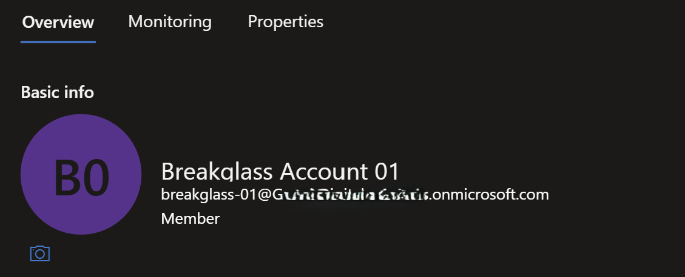
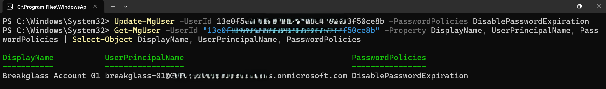
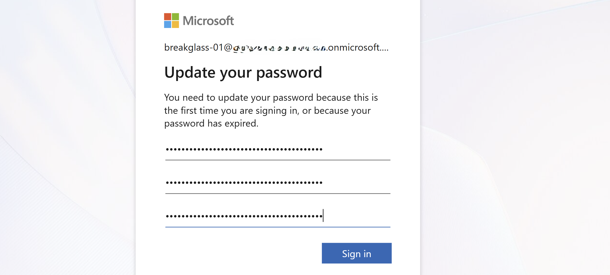
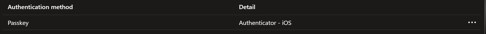
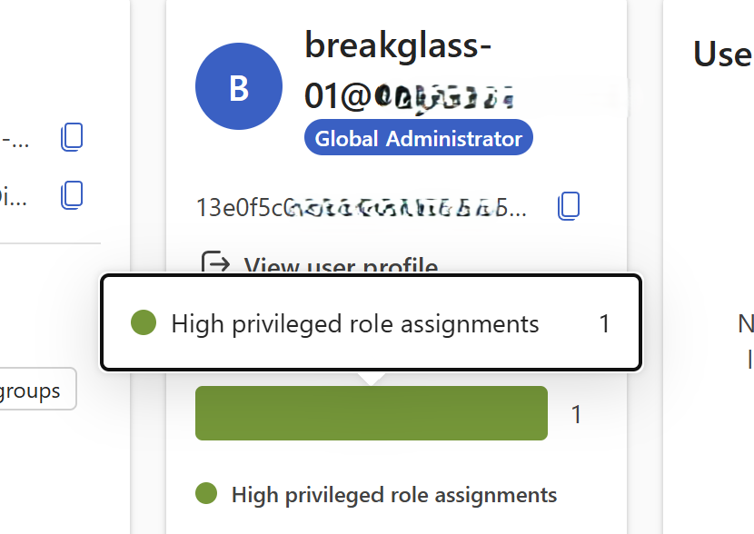

# Break-glass account with phishing-resistant MFA (FIDO2)

**Goal:** create a cloud-only emergency-access (break-glass) account with a permanent Global
Administrator role, then secure it with phishing-resistant MFA (a FIDO2 security key) so it's
the guaranteed way back in if Conditional Access ever locks us out.

> **Best practice:** Microsoft recommends emergency-access accounts use a phishing-resistant
> passwordless method, **passkey (FIDO2)** (recommended) or certificate-based auth, rather than
> a password alone, and that they're excluded from enforced Conditional Access policies.
> See [Manage emergency access accounts in Microsoft Entra ID](https://learn.microsoft.com/entra/identity/role-based-access-control/security-emergency-access).

---

## Phase 1 - Create the break-glass account

**1. Create a break-glass security group** in Entra ID and assign it the permanent Global Administrator role.


**2. Create the break-glass account** (cloud-only, on the `*.onmicrosoft.com` domain).



**3. Add the break-glass account to the break-glass security group.**


**4. In PowerShell, connect to Microsoft Graph and set / verify "password never expires" on the account.**

```powershell
Connect-MgGraph -Scopes "User.ReadWrite.All"

Update-MgUser -UserId <BREAKGLASS_OBJECT_ID> -PasswordPolicies DisablePasswordExpiration

Get-MgUser -UserId "<BREAKGLASS_OBJECT_ID>" -Property DisplayName, UserPrincipalName, PasswordPolicies |
    Select-Object DisplayName, UserPrincipalName, PasswordPolicies
```



---

## Phase 2 - MFA and FIDO2

**1.** Sign in with the break-glass account and change the password to a random, complex string that is saved securely (offline).



**2.** Set up MFA and sign in to the break-glass account for the first time.


**3.** After setting up MFA - configure the FIDO2 key from the Microsoft Authenticator app on the mobile device.

**4.** Sign out and in again: We're now prompted for both MFA and FIDO2 during setup. We test FIDO2 for the first time and it works.

**5.** Go to the break-glass account and check **Authentication methods**, both the normal MFA method and the FIDO2 key are listed.


**6.** Remove the other method so the account uses only phishing-resistant MFA with FIDO2.



**7.** Try to sign in again: we're now prompted only for the FIDO2 key, and sign in.


**8.** We are now signed in as the break-glass account, secured with phishing-resistant MFA (FIDO2).



---

### Reference
- [Manage emergency access accounts in Microsoft Entra ID](https://learn.microsoft.com/entra/identity/role-based-access-control/security-emergency-access) — Microsoft's best-practice guidance (create cloud-only GA accounts, secure with FIDO2/passkey, exclude from Conditional Access, monitor and test).
