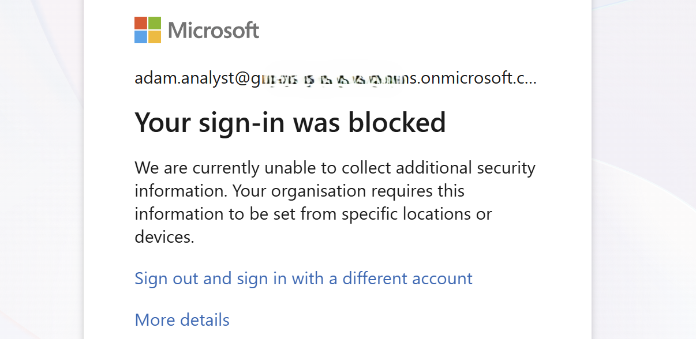
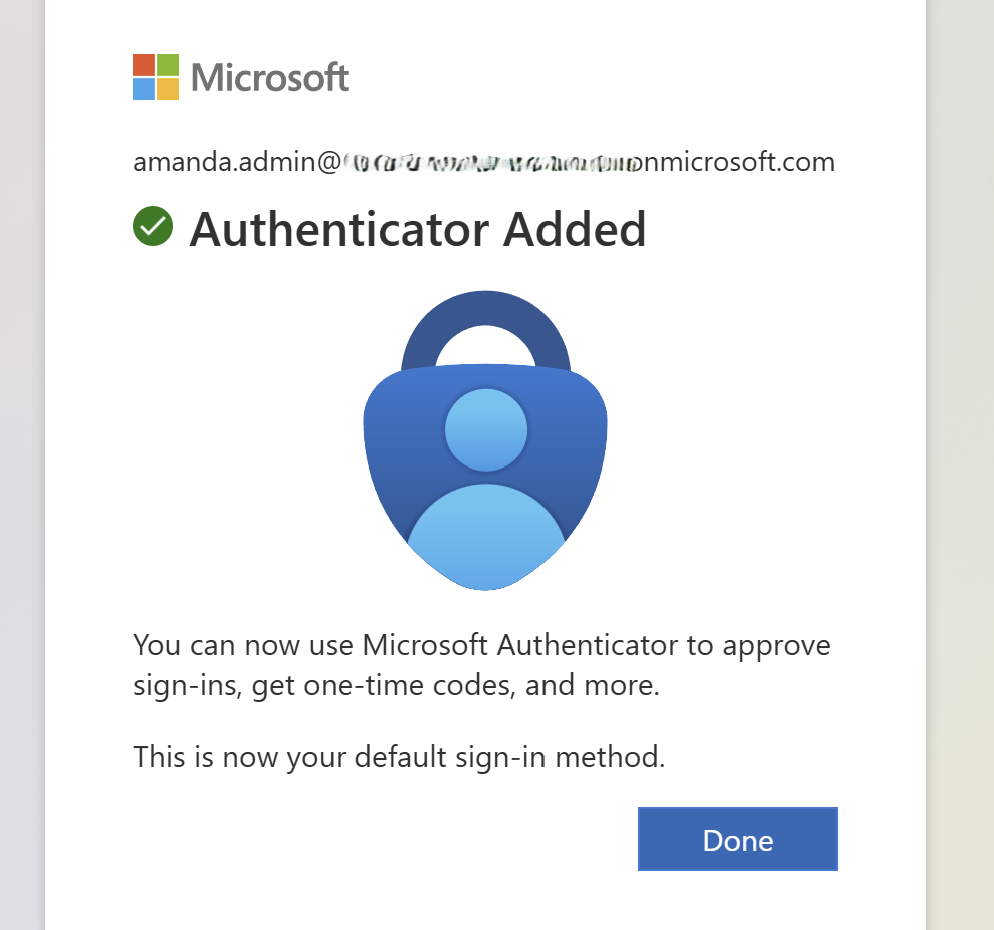
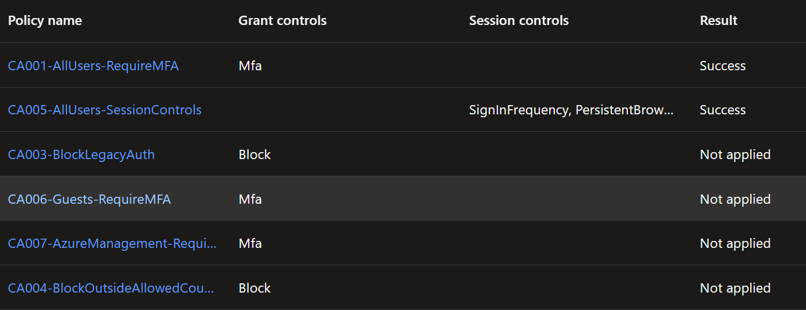
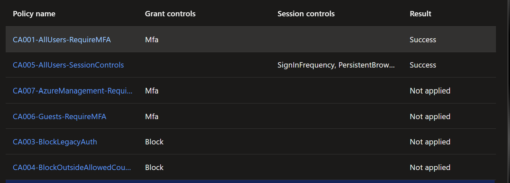
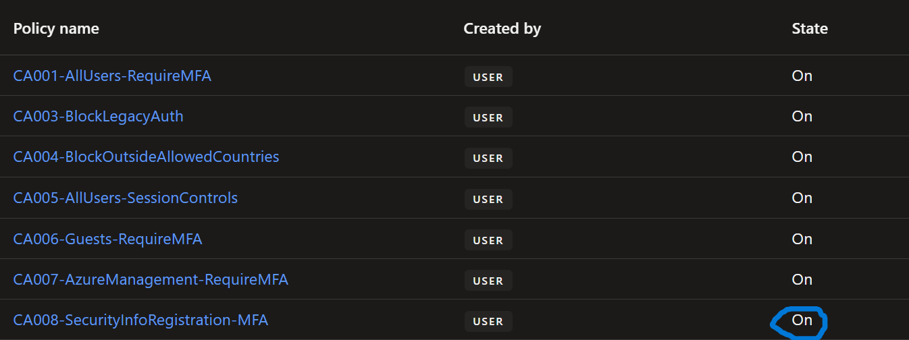

# Conditional Access baseline (tenant-wide)

**Goal:** deploy the baseline Conditional Access policies in report-only, verify them in the
portal, and validate their effect with the What-If tool before anything is enforced. The
break-glass account is excluded from every policy.

> Each policy lives as its own JSON file under `scripts/conditional-access/policies/` and is
> deployed one at a time (or all at once) with `Deploy-CaPolicy.ps1`. See
> [Plan a Conditional Access deployment](https://learn.microsoft.com/entra/identity/conditional-access/plan-conditional-access).

## The policies

| Policy | Who | Control |
| --- | --- | --- |
| `CA001-AllUsers-RequireMFA` | All users | Require MFA |
| `CA003-BlockLegacyAuth` | All users | Block legacy authentication |
| `CA005-AllUsers-SessionControls` | All users | Sign-in frequency + no persistent browser |
| `CA006-Guests-RequireMFA` | Guests / external users | Require MFA |
| `CA007-AzureManagement-RequireMFA` | All users | Require MFA for the Azure management plane |
| `CA008-SecurityInfoRegistration-MFA` | All users | Require MFA to register security info |

All are created in report-only, and the security group `breakglass-accounts` is excluded from each.

---

## Phase 1: Deploy the baseline policies

**1.**We deploy the baseline Conditional Access policies. First, list what is available:

```powershell
.\Deploy-CaPolicy.ps1 -List
```


Then deploy them all (report-only, break-glass excluded, idempotent):

```powershell
.\Deploy-CaPolicy.ps1 -All
```


**2.** Double-check in the portal. Open **Entra ID > Conditional Access > Policies** and confirm the policies and their report-only state.


Open a policy and review its configuration on the **Edit policy** view (assignments, conditions, grant / session controls, and the break-glass exclusion).


---

## Phase 2: Validate with the What-If tool

**1.** In **Entra ID > Conditional Access**, we open the **What-If** tool to see which policies would apply for a given scenario. We simulate **Adam Analyst** accessing the in-house Grafana app from a **Windows** device using **modern authentication**.


We get back the policies that would apply: **require MFA** (CA001) and the **session controls** (CA005).


**2.** We then simulate **Adam Analyst** signing in from a **Linux** device, with the client on an **unsupported platform** (legacy authentication).


The MFA policy still evaluates as required, but access would be **blocked** by the legacy authentication block policy (CA003).


---

## Enforce (separate, deliberate step)

Deployment only ever creates report-only policies. After the What-If checks and the report-only
impact look right, we enforce one policy at a time:

```powershell
$p = Get-MgIdentityConditionalAccessPolicy -All | Where-Object DisplayName -eq "CA001-AllUsers-RequireMFA"
Update-MgIdentityConditionalAccessPolicy -ConditionalAccessPolicyId $p.Id -State "enabled"
```

We can now se in the portal that all policies show as 'State: On', rather than 'report-only'.


---

## Phase 3: Testing first sign-in and policy behaviors

With the policies enforced, we test how they behave for a user signing in for the first time.

**1.** We reset **Adam Analyst**'s password in the portal and sign in interactively for the first time. We are prompted to set up MFA, but when we proceed to register it, we get **access blocked**.



**2.** We open the **Sign-in logs** and see the policies that blocked the sign-in: `CA001-AllUsers-RequireMFA` and `CA008-SecurityInfoRegistration-MFA`.


Why this happens: `CA001` requires MFA on every sign-in, so Entra interrupts Adam to register a method. But registering security info is itself gated by `CA008`, which requires MFA to register. After the password reset Adam has no usable method, so he can satisfy neither: he needs MFA to sign in, and MFA to register MFA. This chicken-and-egg is by design. The proper way out is a Temporary Access Pass (see `tap-mfa-onboarding.md`) or a trusted-location exception on CA008.

**3.** For this walkthrough we take the simple path instead of a TAP: we set **`CA008-SecurityInfoRegistration-MFA` to report-only**, then test with **Amanda Admin**.

With CA008 no longer enforced, Amanda signs in to Microsoft 365 successfully and is prompted to set up MFA.


She completes MFA registration.



**4.** Now that Amanda has a registered MFA method, she signs in to the **Azure / Entra admin portal** and we open her entry in **Sign-in logs > Conditional Access** to see which policies were applied. Three evaluate as **Success**: `CA001-AllUsers-RequireMFA` (she satisfied MFA), `CA005-AllUsers-SessionControls` (session controls applied), and `CA007-AzureManagement-RequireMFA` (this sign-in targeted the Microsoft Azure Management app, so its resource condition matched). The remaining policies show **Not applied** because their conditions were not met by this sign-in: `CA003` (legacy auth, she used a modern browser), `CA004` (country, she signed in from an allowed country), and `CA006` (guests, she is an internal member).



Note how CA007 is the differentiator: on a normal Office or Grafana sign-in it shows Not applied, but here, because the target resource is the Azure management plane, it fires. That is app-scoped Conditional Access working as intended.

This is the contrast with Adam Analyst: same enforced policies, but Amanda already has an MFA method so she passes, whereas Adam had none and was deadlocked at registration. Enforcement is safe for users who already have MFA; the gap is method-less users (new hires, or password resets that clear methods), which the Temporary Access Pass onboarding closes (`tap-mfa-onboarding.md`).

**5.** Amanda signs in to the in-house Grafana app. In the Conditional Access results only `CA001-AllUsers-RequireMFA` and `CA005-AllUsers-SessionControls` apply: Grafana is not the Azure management app, not a legacy or guest scenario, and she is in an allowed country, so the other policies stay out of scope.



`CA008-SecurityInfoRegistration-MFA` does not show here at all, because it is still in report-only (its results live under the separate **Report-only** tab, not the Conditional Access tab).


**6.** We switch `CA008` from report-only to **On**.



**7.** We sign in to Grafana again as Amanda and check the sign-in logs. `CA008` still shows **Not applied**, even though it is now enforced.


Why 'CA008' is still Not applied: `CA008` is scoped to the **Register security information** user action, not to application sign-ins. A normal sign-in to Grafana (or any app) does not trigger that action, so the policy is out of scope and shows Not applied. Enforcing it changed its *state*, not its *scope*, it only evaluates when a user actually goes to register or change their security info.

---

### Reference
- [Conditional Access What-If tool](https://learn.microsoft.com/entra/identity/conditional-access/what-if-tool)
- [Plan a Conditional Access deployment](https://learn.microsoft.com/entra/identity/conditional-access/plan-conditional-access)
- [Conditional Access report-only mode](https://learn.microsoft.com/entra/identity/conditional-access/concept-conditional-access-report-only)
