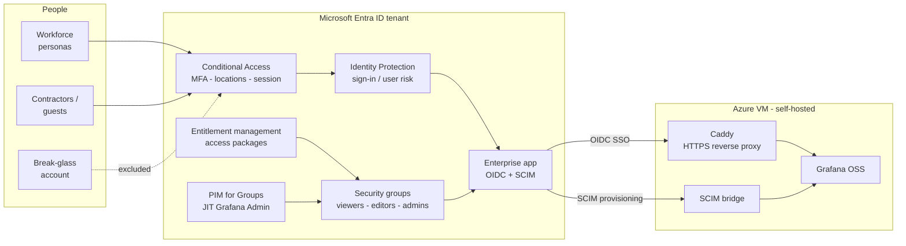

# Access Control & Identity Governance on Microsoft Entra ID

Governing access to a self-hosted Grafana app with Entra ID: Conditional Access, risk-based
policies, PIM, self-service access packages, and access reviews. Nine CA policies deployed from
JSON, four entitlement-management scripts, three recurring access reviews, all tested against
real sign-ins.


Builds on [Workforce Identity Lifecycle (SSO + SCIM)](https://github.com/sindredg/entra-app-roles-sso-scim).

| Phase | Built | Docs |
| --- | --- | --- |
| 0 | Break-glass account, FIDO2-only, permanent GA | [break-glass](docs/00-breakglass-setup.md) |
| 1 | Six baseline CA policies, report-only then enforced | [conditional-access](docs/01-conditional-access.md) |
| 2 | Country allow-list + sign-in/user risk, proven with a VPN | [context-risk](docs/02-ca-context-risk.md) |
| 3 | JIT Grafana Admin via PIM for Groups | [pim](docs/03-pim.md) |
| 4 | Access packages, self-service request to Grafana account | [entitlement-management](docs/04-entitlement-management.md) |
| 5 | Three access reviews, auto-revoke scaled to risk | [access-reviews](docs/05-access-reviews.md) |

Also: [troubleshooting log](docs/99-troubleshooting.md), [decisions](docs/decisions.md),
[risk and limitations](docs/risk-and-limitations.md).

## Architecture

Two planes. The **identity plane** is the Entra tenant, where every access decision is made.
The **application plane** is an Azure VM running Grafana behind a Caddy HTTPS proxy, plus a SCIM
bridge that calls the Grafana admin API. Grafana makes no authorization decisions of its own; it
trusts the token and the provisioned account.



1. **Sign-in.** CA evaluates MFA, location and session controls; Identity Protection scores
   sign-in and user risk. Entra issues an OIDC token with the app-role claim, and Grafana maps it
   to Viewer / Editor / Admin.
2. **Provisioning.** Group membership flows to Grafana over SCIM, so a grant ends in a real
   Grafana account and a revoke deprovisions it.
3. **Self-service (Phase 4).** A request in My Access, approved, adds the user to the Grafana
   group, time-bound and audited.
4. **Just-in-time (Phase 3).** No standing Grafana Admin. Eligible users activate through PIM with
   MFA, justification and approval; a fresh sign-in surfaces the Admin role.
5. **Review (Phase 5).** Recurring reviews re-attest each tier. Denials auto-revoke for viewers,
   manual apply for editors and admin eligibility.
6. **Break-glass.** One account with standing Global Admin and a FIDO2 key, excluded from every CA
   policy and never placed under PIM.

## Conditional Access policies

Every policy is a JSON file deployed by `Deploy-CaPolicy.ps1`, authored in report-only, with the
break-glass group excluded. `CA002` and `CA009` are reserved and not built.

| Policy | What it does |
| --- | --- |
| `CA001-AllUsers-RequireMFA` | Require MFA for all users |
| `CA003-BlockLegacyAuth` | Block legacy authentication |
| `CA004-BlockOutsideAllowedCountries` | Block outside Norway, Spain, UK |
| `CA005-AllUsers-SessionControls` | 8h sign-in frequency + no persistent browser |
| `CA006-Guests-RequireMFA` | MFA for guest / external users |
| `CA007-AzureManagement-RequireMFA` | MFA for the Azure management plane |
| `CA008-SecurityInfoRegistration-MFA` | MFA to register / change security info |
| `CA010-SignInRisk-Block` | Block on medium / high sign-in risk |
| `CA011-UserRisk-RequirePasswordChange` | MFA + secure password change on high user risk |

## The cast

| Persona | Group | Role | Used for |
| --- | --- | --- | --- |
| Amanda Admin | `grafana-editors` standing, `grafana-admins` eligible | Editor, Admin via PIM | Activates Admin JIT (P3), approves as manager (P4), reviews viewers (P5) |
| Edvard Editor | `grafana-editors` standing, `grafana-admins` eligible | Editor, Admin via PIM | PIM eligibility (P3) |
| Nils Normal | `grafana-viewers` via access package | Viewer | Ran the request flow end to end (P4), reviewed by his manager (P5) |
| Adam Analyst | `grafana-editors` standing | Editor | Hit the CA008 registration deadlock, unblocked with a TAP (P1) |
| Victoria Viewer | `grafana-viewers` | Viewer | Standard workforce user |
| Carla Contractor | external (B2B) | Viewer | Contractor package and guest governance (P4, design only) |
| Break-glass | `breakglass-accounts` | Global Admin | Emergency access, FIDO2, excluded from all CA and PIM |
| Sindre G | - | IAM Architect | PIM approver (P3), contractor approver (P4), editor and admin reviewer (P5) |

## Repository layout

```
├── docs/
│   ├── 00-breakglass-setup.md        Break-glass account + FIDO2
│   ├── 01-conditional-access.md      CA baseline + enforcement behaviour
│   ├── 02-ca-context-risk.md         Country allow-list + risk policies
│   ├── 03-pim.md                     Just-in-time Grafana Admin
│   ├── 04-entitlement-management.md  Access packages, self-service, SoD
│   ├── 05-access-reviews.md          Three reviews across the three tiers
│   ├── 99-troubleshooting.md         Symptom / cause / fix / lesson
│   ├── decisions.md                  Debatable choices and consequences
│   ├── risk-and-limitations.md       What this does not do
│   └── images/                       Evidence per phase
└── scripts/
    ├── conditional-access/
    │   ├── Deploy-CaPolicy.ps1       Deploy one policy or all, report-only, idempotent
    │   ├── policies/                 One JSON per CA policy
    │   └── named-locations/          Country allow-list as JSON
    └── entitlement-management/
        ├── 01-catalog-resource.ps1   Catalog + grafana-viewers resource
        ├── 02-access-packages.ps1    The two packages + Member role scope
        ├── 03-assignment-policies.ps1 Request / approval / expiry policies
        └── 04-separation-of-duties.ps1 Mark the two packages incompatible
```

## Conventions

- No secrets in the repo. Tenant IDs and object GUIDs are placeholders.
- Break-glass exists before any policy is enforced, and is excluded from all of them.
- Report-only before enforce. Enforcement is always a separate manual step.
- Repetitive work is scripted with Graph PowerShell and idempotent. One-time privileged config
  (PIM, access reviews, break-glass) is done in the portal so every setting is visible.
- Every phase ends with a test matrix and evidence screenshots.

> The lab tenant and Grafana environment get torn down between sessions, so live hostnames and
> object IDs are not guaranteed to be reachable.
