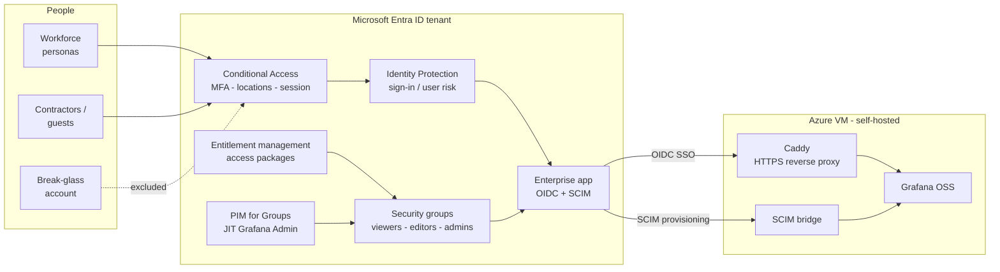

# Access Control & Identity Governance on Entra ID

> **Status: work in progress.** Phases 0 to 4 are built and documented (foundations, Conditional
> Access, locations and risk, Privileged Identity Management, entitlement management). The remaining
> governance phases (access reviews, lifecycle workflows, monitoring) are planned. This README grows
> as they land.

A hands-on lab that governs access to a self-hosted application with Microsoft Entra ID: Conditional
Access, risk-based policies, Privileged Identity Management, and self-service entitlement management.

Check docs/ for: [documented walkthroughs and the troubleshooting log](docs/)

It builds directly on [IAM-on-self-hosted-webapp](https://github.com/sindredg/IAM-on-self-hosted-webapp),
which stood up Entra ID as the identity provider for a self-hosted **Grafana** web app (with OIDC SSO,
app-role mapping, SCIM provisioning). Where that project answered *who can sign in and what role
they get*, this one governs *under what conditions they sign in, how privilege is granted, and how
access is requested, reviewed, and revoked*.

Inspired by the learning paths: [Authentication and access management (https://learn.microsoft.com/training/paths/implement-authentication-access-management-solution/)
and [Identity governance strategy](https://learn.microsoft.com/training/paths/plan-implement-identity-governance-strategy/).

## Architecture

Two planes. The **identity plane** is the Entra ID tenant, where every access decision is made:
Conditional Access and Identity Protection decide *whether* a sign-in is allowed, PIM and entitlement
management decide *who holds which group*, and the enterprise app turns group membership into a
Grafana role. The **application plane** is a self-hosted Azure VM running Grafana web app behind a Caddy
HTTPS proxy, plus a small SCIM bridge that receives provisioning from Entra and calls the Grafana
admin API. Grafana itself makes no authorization decisions; it trusts the token and the provisioned
account.



How the pieces move:

1. **Sign-in.** A user authenticates to Entra. Conditional Access evaluates MFA, location, and
   session controls; Identity Protection scores sign-in and user risk. If allowed, Entra issues an
   OIDC token carrying the user's app-role claim, and Grafana maps it to Viewer / Editor / Admin.
2. **Provisioning.** Group membership flows to Grafana through SCIM: the enterprise app pushes
   create / update / disable to the SCIM bridge, which calls the Grafana admin API, so an access
   grant ends in a real Grafana account and a revoke deprovisions it.
3. **Self-service request (Phase 4).** A user requests an access package in My Access; on approval,
   Entra adds them to the Grafana group, which provisions them in via SCIM, time-bound and audited.
4. **Just-in-time privilege (Phase 3).** No one holds standing Grafana Admin. Eligible users activate
   through PIM with MFA, justification, and approval; activation adds them to `grafana-admins` for a
   limited window, and a fresh sign-in surfaces the Admin role.
5. **Break-glass.** One emergency account with standing Global Admin and a FIDO2 key sits outside
   every Conditional Access policy and is never placed under PIM, so a misconfigured policy can never
   lock everyone out.

## Status by phase

| Phase | Focus | State | Docs |
| --- | --- | --- | --- |
| 0 | Foundations: break-glass account (FIDO2), personas | Done | [break-glass](docs/00-phase0-breakglass-walkthrough.md) |
| 1 | Conditional Access baseline (MFA, legacy-auth, session, guests, mgmt, security-info) | Done | [conditional-access](docs/01-conditional-access.md) |
| 2 | Locations and risk (country allow-list, sign-in / user risk) | Done | [context-risk](docs/02-ca-context-risk.md) |
| 3 | Privileged Identity Management (JIT admin, PIM for Groups) | Done | [pim](docs/03-pim.md) |
| 4 | Entitlement management (access packages, self-service, SoD) | Done | [entitlement-management](docs/04-entitlement-management.md) |
| 5 | Access reviews | Planned | |
| 6 | Lifecycle workflows (joiner / mover / leaver) | Planned | |
| 7 | Monitoring, audit and evidence | Planned | |

The [troubleshooting log](docs/99-troubleshooting.md) is where the unexpected things (and the real
learning) are captured.

## Conditional Access policies (built)

Every policy is a JSON definition deployed one at a time (or all) with `Deploy-CaPolicy.ps1`,
authored in report-only, with the break-glass group excluded.

| Policy | What it does |
| --- | --- |
| `CA001-AllUsers-RequireMFA` | Require MFA for all users |
| `CA003-BlockLegacyAuth` | Block legacy authentication |
| `CA004-BlockOutsideAllowedCountries` | Block sign-ins outside the allowed countries (Norway, Spain, UK) |
| `CA005-AllUsers-SessionControls` | Sign-in frequency + no persistent browser |
| `CA006-Guests-RequireMFA` | MFA for guest / external users |
| `CA007-AzureManagement-RequireMFA` | MFA for the Azure management plane |
| `CA008-SecurityInfoRegistration-MFA` | MFA to register / change security info |
| `CA010-SignInRisk-Block` | Block on medium / high sign-in risk (Identity Protection) |
| `CA011-UserRisk-RequirePasswordChange` | MFA + secure password change on high user risk |

## The cast

| Persona | Group | Role | Purpose |
| --- | --- | --- | --- |
| Amanda Admin | `grafana-editors` (standing), `grafana-admins` (eligible) | Editor by default, Admin via PIM | Standing Editor; activates Grafana Admin just-in-time (Phase 3); approves access-package requests as manager (Phase 4) |
| Edvard Editor | `grafana-editors` (standing), `grafana-admins` (eligible) | Editor, Admin via PIM | Standing Editor; PIM-eligible for Admin (Phase 3) |
| Nils Normal | `grafana-viewers` (via access package) | Viewer | Requested the viewer access package end to end (Phase 4); drives the lifecycle workflow (Phase 6) |
| Adam Analyst | `grafana-editors` (standing) | — | Comditional access blocks MFA setup (Phase 2) |
| Victoria Viewer | `grafana-viewers` | Viewer | Standard workforce user |
| Carla Contractor | external (B2B) | Viewer | Contractor access package + guest governance (Phase 4, design) |
| Break-glass | `breakglass-accounts` | Global Admin | Emergency access, FIDO2, excluded from all CA and PIM |
| Sindre G | — | IAM Architect | Approver / reviewer: PIM approver (Phase 3), contractor-package approver (Phase 4) |

## Repository layout

```
Access-Control-and-Identity-Governance/
├── README.md                              This file
├── docs/
│   ├── 00-phase0-breakglass-walkthrough.md  Phase 0: break-glass account + FIDO2 (portal)
│   ├── 01-conditional-access.md             Phase 1: CA baseline + enforcement behavior
│   ├── 02-ca-context-risk.md                Phase 2: country allow-list + risk policies
│   ├── 03-pim.md                            Phase 3: just-in-time Grafana Admin (PIM for Groups)
│   ├── 04-entitlement-management.md         Phase 4: access packages (self-service, SoD)
│   ├── 99-troubleshooting.md                Symptom / cause / fix / lesson log
│   └── images/                              Evidence screenshots, per phase (images/phase#/)
└── scripts/
    ├── conditional-access/
    │   ├── Deploy-CaPolicy.ps1              Deploy one policy (or all), report-only, idempotent
    │   ├── policies/                        One JSON per CA policy
    │   └── named-locations/                 Country allow-list as JSON
    └── entitlement-management/
        ├── 01-catalog-resource.ps1          Catalog + grafana-viewers resource
        ├── 02-access-packages.ps1           The two packages + Member role scope
        ├── 03-assignment-policies.ps1       Request / approval / expiry policies
        ├── 04-separation-of-duties.ps1      Mark the two packages incompatible
        └── README.md                        Run order snippet
```

## Conventions

- **No secrets in the repo.** Placeholders only; tenant IDs and object GUIDs are not committed.
- **Break-glass first, always excluded.** It exists before any policy is enforced and is excluded
  from every Conditional Access policy.
- **Report-only before enforce.** No policy goes straight to On; enforcement is a separate, manual step.
- **The things that belong in the portal, we do in the portal;** the repetitive / at-scale work is
  scripted (Microsoft Graph PowerShell), idempotent, and kept as code.
- **Every phase ends with a test matrix** (positive and negative cases) and evidence screenshots.
- **The troubleshooting log is where the real learning lives** (the walkthroughs show the clean path).

> Note: the lab tenant and the Grafana environment may be torn down between sessions, so live
> hostnames and object IDs are not guaranteed to be reachable.
