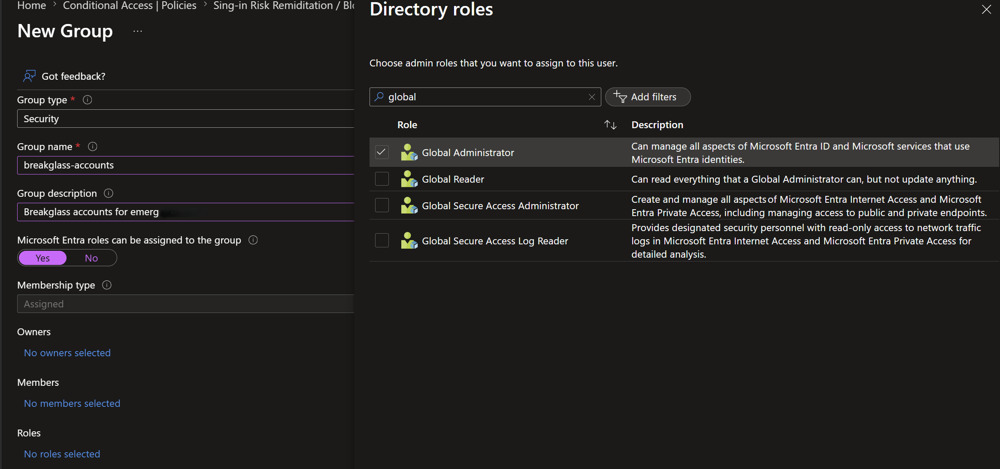
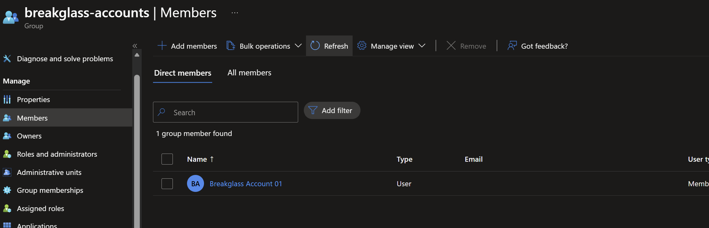
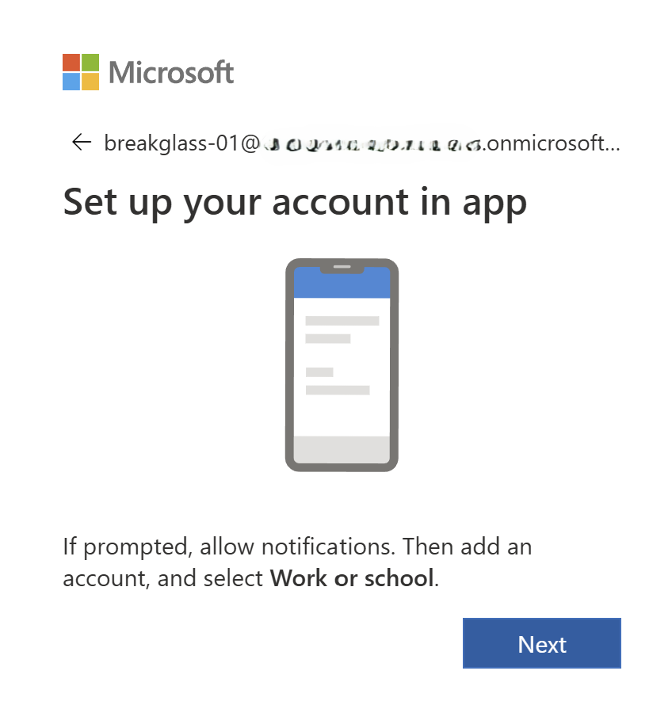
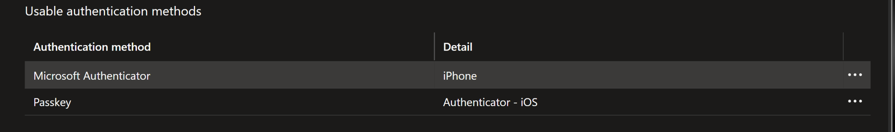
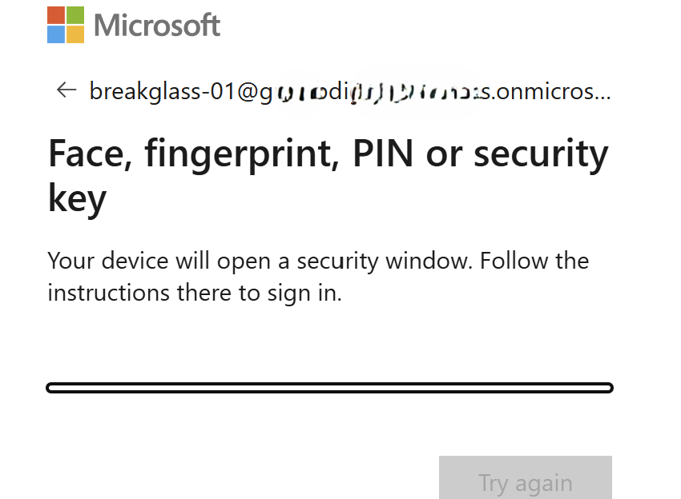

# Break-glass account with phishing-resistant MFA (FIDO2)

**Built:** a cloud-only emergency-access account with a permanent Global Administrator role,
secured with a FIDO2 key as its only authentication method, excluded from every Conditional Access
policy.

> Microsoft recommends emergency-access accounts use a phishing-resistant passwordless method
> (passkey/FIDO2 or certificate-based auth) rather than a password, and that they are excluded from
> enforced Conditional Access.
> [Manage emergency access accounts](https://learn.microsoft.com/entra/identity/role-based-access-control/security-emergency-access).

**Where this differs from best practice.** Microsoft recommends at least two emergency-access
accounts. We run one, so the FIDO2 key is a single point of failure, and nothing alerts on
break-glass sign-ins. See [decision 1](decisions.md) and the
[risk register](risk-and-limitations.md).

---

## 1. Create the account

**1.** Create a break-glass security group and assign it the permanent Global Administrator role.



**2.** Create the account, cloud-only, on the `*.onmicrosoft.com` domain.


**3.** Add the account to the group.



**4.** Set and verify "password never expires":

```powershell
Connect-MgGraph -Scopes "User.ReadWrite.All"

Update-MgUser -UserId <BREAKGLASS_OBJECT_ID> -PasswordPolicies DisablePasswordExpiration

Get-MgUser -UserId "<BREAKGLASS_OBJECT_ID>" -Property DisplayName, UserPrincipalName, PasswordPolicies |
    Select-Object DisplayName, UserPrincipalName, PasswordPolicies
```


---

## 2. MFA and FIDO2

**1.** Sign in and change the password to a random complex string, stored offline.


**2.** Set up MFA.



**3.** Configure the FIDO2 key from the Authenticator app on the mobile device.

**4.** Sign out and in. Prompted for both MFA and FIDO2, and FIDO2 works.

**5.** **Authentication methods** on the account now lists both the normal MFA method and the key.



**6.** Remove the other method, leaving FIDO2 alone.


**7.** Sign in again. Only the FIDO2 key is offered.




Registering a passkey makes the method available, it does not make Entra require it. Stripping the
other methods is what forces phishing-resistant sign-in here. See the
[troubleshooting log](99-troubleshooting.md) for the SSPR proof-up that kept re-adding one.

---

## Verification / test matrix

| # | Test | Type | Result |
| --- | --- | --- | --- |
| 1 | Break-glass signs in with the FIDO2 key | + | Succeeds passwordless, no other prompt |
| 2 | Only the FIDO2 method is registered | control | Authenticator and phone removed, key is the sole method |
| 3 | Password set to never expire | control | Verified through Graph (`PasswordPolicies`) |
| 4 | Sign-in offers a non-FIDO2 method | - | Does not happen; if it does, an unwanted method is still registered |
| 5 | Break-glass under enforced Conditional Access | + / control | Confirmed in Phases 1 and 3, keeps access with every policy On |

Not covered: alerting on break-glass use. Tracked in the
[risk register](risk-and-limitations.md).

---

### Reference
- [Manage emergency access accounts in Microsoft Entra ID](https://learn.microsoft.com/entra/identity/role-based-access-control/security-emergency-access)
