# Conditional Access baseline (tenant-wide)

**Built:** six baseline Conditional Access policies, deployed from JSON in report-only, validated
with What-If, then enforced one at a time. The break-glass group is excluded from every policy.

> One JSON per policy under `scripts/conditional-access/policies/`, deployed with
> `Deploy-CaPolicy.ps1`.
> [Plan a Conditional Access deployment](https://learn.microsoft.com/entra/identity/conditional-access/plan-conditional-access).

| Policy | Who | Control |
| --- | --- | --- |
| `CA001-AllUsers-RequireMFA` | All users | Require MFA |
| `CA003-BlockLegacyAuth` | All users | Block legacy authentication |
| `CA005-AllUsers-SessionControls` | All users | Sign-in frequency + no persistent browser |
| `CA006-Guests-RequireMFA` | Guests / external users | Require MFA |
| `CA007-AzureManagement-RequireMFA` | All users | Require MFA for the Azure management plane |
| `CA008-SecurityInfoRegistration-MFA` | All users | Require MFA to register security info |

**Where this differs from best practice.** CA005 (8-hour sign-in frequency, no persistent browser)
is the highest-friction policy and would normally be scoped to admins or unmanaged devices rather
than everyone. CA008 gates MFA registration, which can deadlock a user who has no method yet, so it
normally ships with TAP onboarding or a trusted-location exception. Both are covered in
[decisions.md](decisions.md) and the [troubleshooting log](99-troubleshooting.md).

---

## 1. Deploy the baseline

List what is available:

```powershell
.\Deploy-CaPolicy.ps1 -List
```

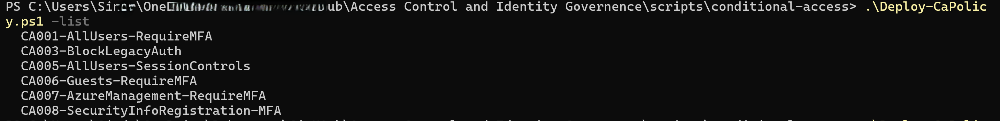

Deploy them all, report-only, break-glass excluded, idempotent:

```powershell
.\Deploy-CaPolicy.ps1 -All
```

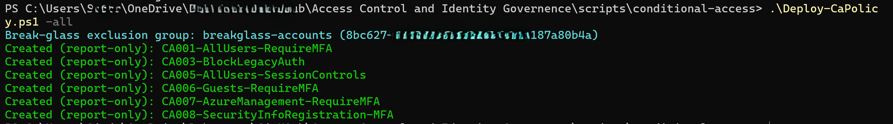

Confirm in **Entra ID > Conditional Access > Policies** that they exist and are report-only.

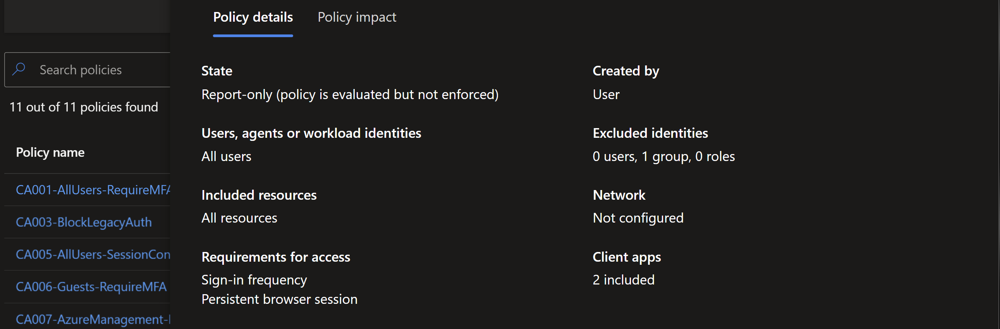

Open one and check assignments, conditions, grant/session controls and the break-glass exclusion.

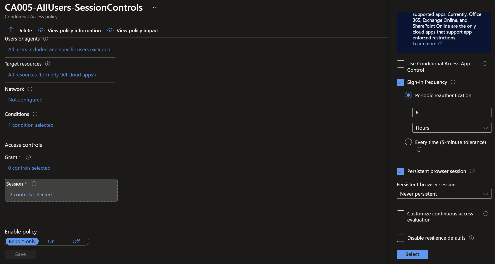

---

## 2. Validate with What-If

**1.** Simulate **Adam Analyst** reaching Grafana from a **Windows** device on **modern auth**.

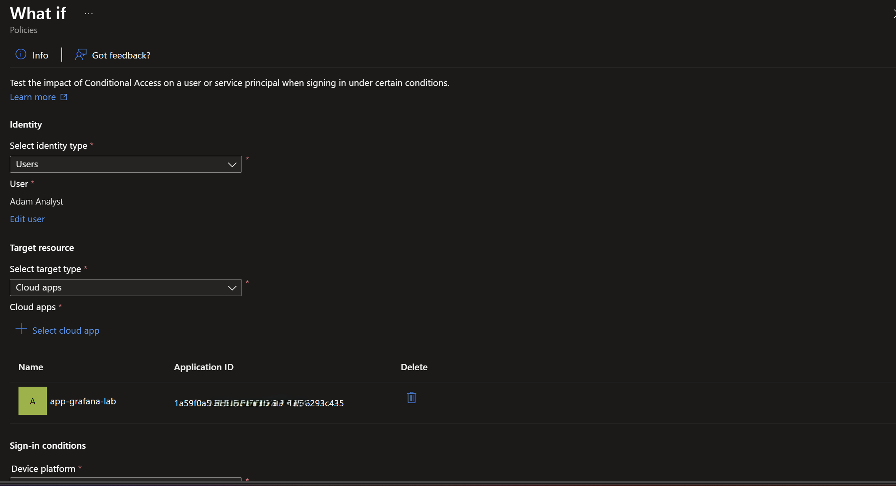

CA001 (MFA) and CA005 (session controls) apply.

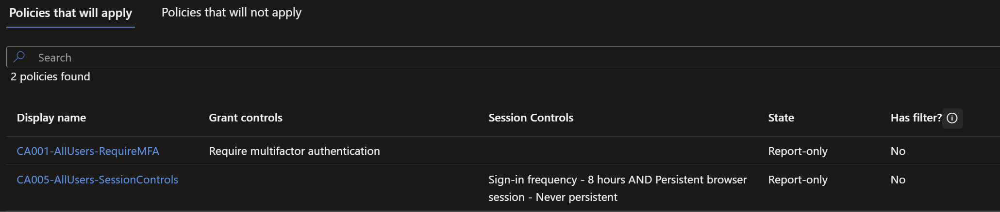

**2.** Same user from a **Linux** device on an **unsupported platform** (legacy auth).

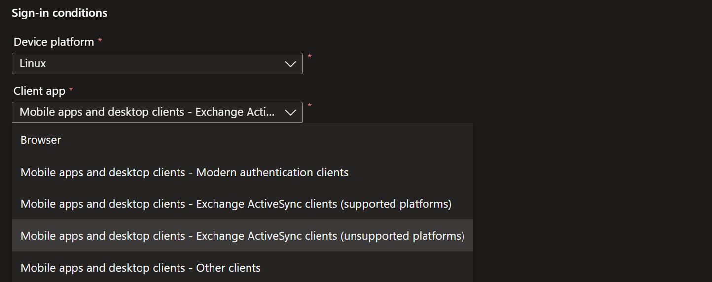

MFA still evaluates as required, but CA003 blocks the sign-in.

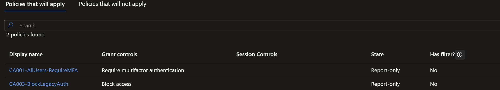

---

## 3. Enforce

Deployment only ever creates report-only policies. Enforce one at a time:

```powershell
$p = Get-MgIdentityConditionalAccessPolicy -All | Where-Object DisplayName -eq "CA001-AllUsers-RequireMFA"
Update-MgIdentityConditionalAccessPolicy -ConditionalAccessPolicyId $p.Id -State "enabled"
```

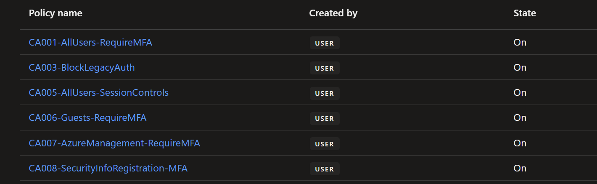

---

## 4. Behaviour under enforcement

**1.** We reset **Adam Analyst**'s password and sign in for the first time. Entra prompts for MFA
setup, then blocks the registration.


**2.** Sign-in logs name the two policies: `CA001-AllUsers-RequireMFA` and
`CA008-SecurityInfoRegistration-MFA`.

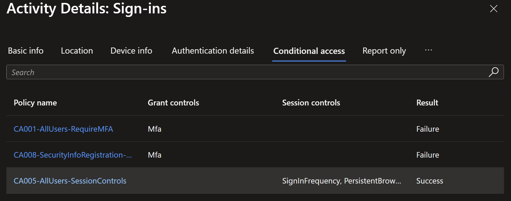

CA001 requires MFA on every sign-in, so Entra interrupts Adam to register a method. Registering is
itself gated by CA008, which requires MFA. After the password reset he has no usable method, so he
can satisfy neither. The way out is a Temporary Access Pass (see the
[troubleshooting log](99-troubleshooting.md)) or a trusted-location exception on CA008.

**3.** For this walkthrough we take the shorter path: set CA008 back to report-only and test with
**Amanda Admin**, who signs in and is prompted to register.

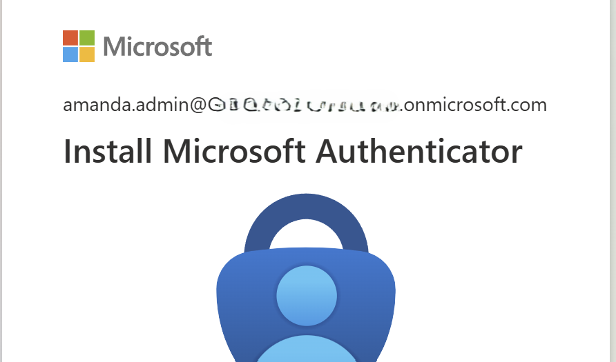

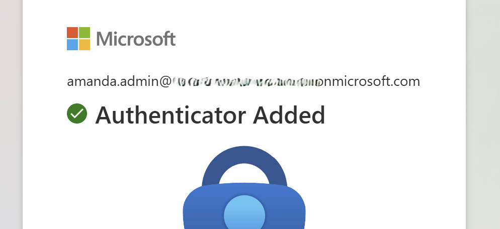

**4.** Amanda signs in to the **Azure / Entra admin portal**. Three policies evaluate as Success:
CA001 (she satisfied MFA), CA005 (session controls), and CA007, because this sign-in targets the
Azure Management app and its resource condition matches. CA003, CA004 and CA006 show **Not applied**:
modern browser, allowed country, internal member.


CA007 is the differentiator. On a normal Office or Grafana sign-in it shows Not applied; here the
target resource is the management plane, so it fires.

The contrast with Adam: same enforced policies, but Amanda already had a method. Enforcement is safe
for users who have MFA; the gap is method-less users, which TAP onboarding closes.

**5.** Amanda signs in to Grafana. Only CA001 and CA005 apply, since Grafana is not the management
app, not legacy, not a guest scenario, and she is in an allowed country.


CA008 does not appear at all, because it is still report-only and its results live under the
separate **Report-only** tab.

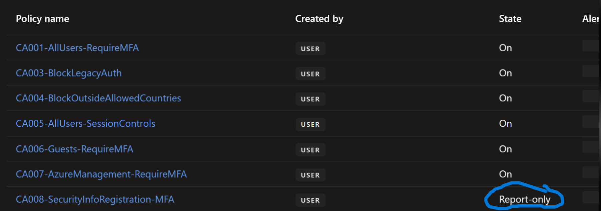

**6.** Switch CA008 to **On**.


**7.** Sign in to Grafana again. CA008 still shows **Not applied**.

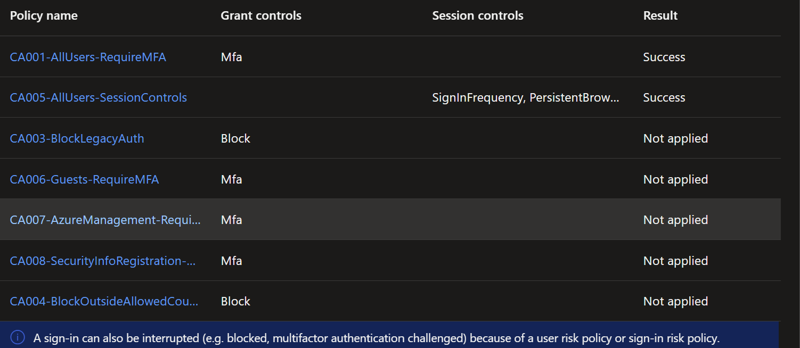

CA008 is scoped to the **Register security information** user action, not to application sign-ins.
Enforcing it changed its state, not its scope.

---

## Verification / test matrix

| # | Test | Type | Result |
| --- | --- | --- | --- |
| 1 | What-If: Adam, Windows, modern auth | + | CA001 (MFA) and CA005 (session) apply |
| 2 | What-If: Adam, Linux, legacy client | - | Blocked by CA003 (legacy auth) |
| 3 | Adam signs in after a password reset with no MFA method | - | Deadlocked: CA001 needs MFA, CA008 gates registration behind MFA. A TAP is the way out |
| 4 | Amanda (MFA registered) signs in to the Azure portal | + | CA001, CA005, CA007 succeed; CA003, CA004, CA006 not applied |
| 5 | Amanda signs in to Grafana | + / scoping | Only CA001 and CA005 apply; CA007 not applied, Grafana is not the management app |
| 6 | CA008 enforced, then a normal app sign-in | control | Not applied: scoped to the register-security-info action |
| 7 | Break-glass account under the enforced policies | + / control | Excluded from all, keeps access |

---

### Reference
- [Conditional Access What-If tool](https://learn.microsoft.com/entra/identity/conditional-access/what-if-tool)
- [Plan a Conditional Access deployment](https://learn.microsoft.com/entra/identity/conditional-access/plan-conditional-access)
- [Conditional Access report-only mode](https://learn.microsoft.com/entra/identity/conditional-access/concept-conditional-access-report-only)
