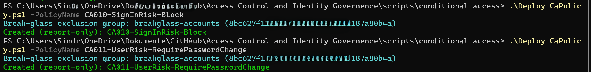
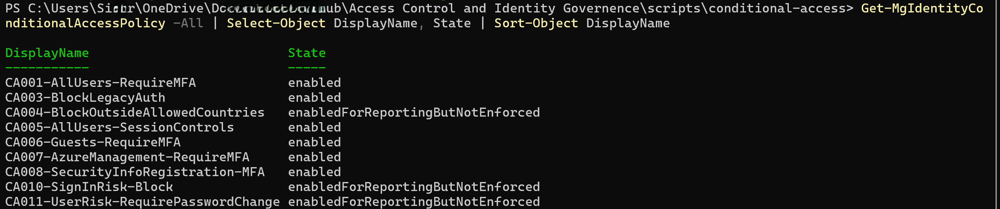
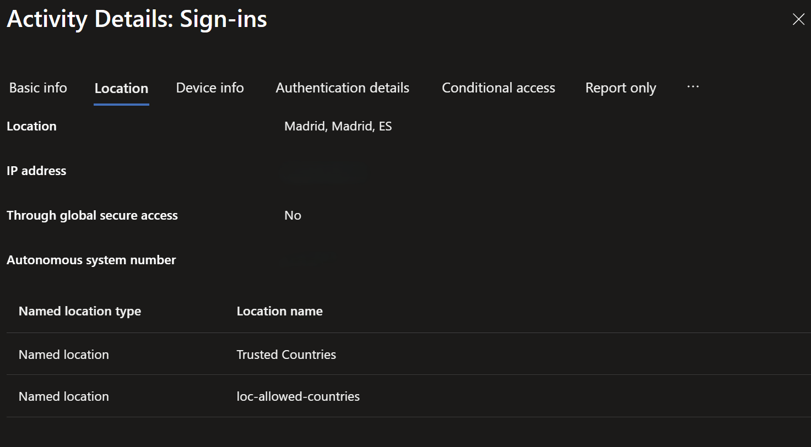
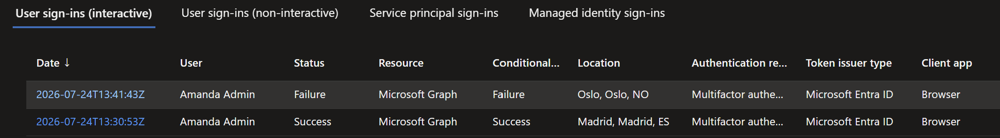
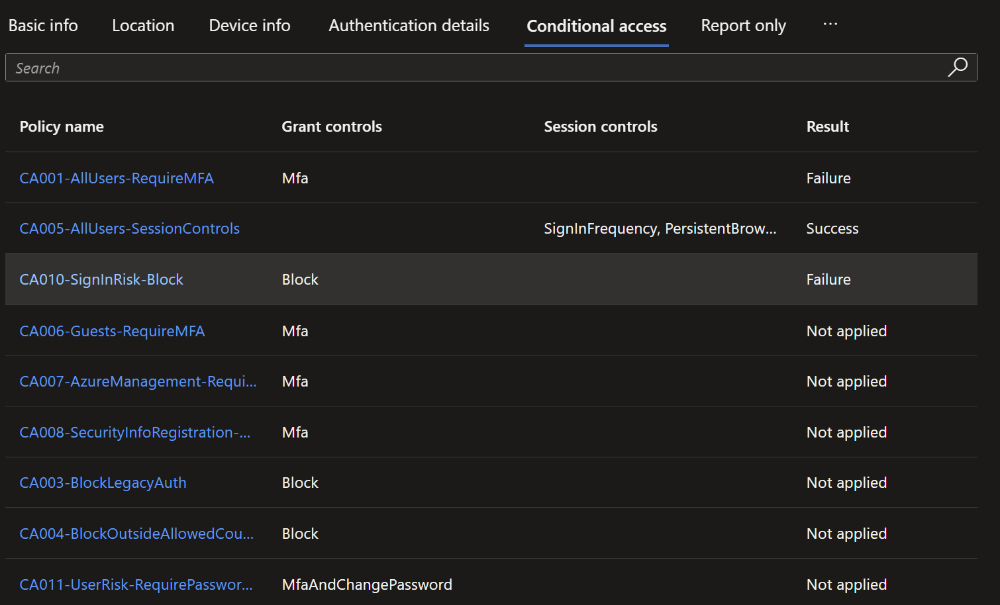
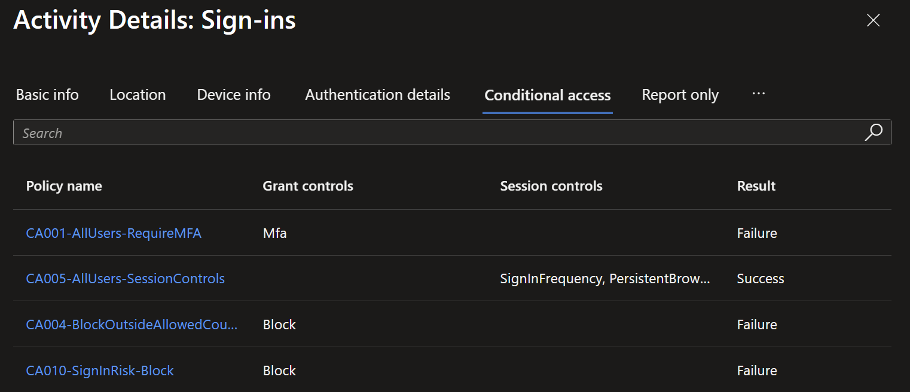
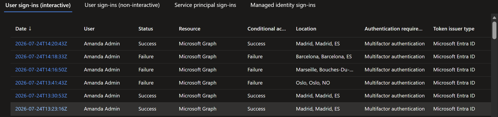

# Conditional Access: locations and risk (Phase 2)

**Built:** a country allow-list as code plus two Identity Protection risk policies, then proven by
triggering a real atypical-travel block with a VPN across four countries.

> Requires Entra ID P2. Same deploy path as the baseline: one JSON per policy, report-only first,
> break-glass excluded.
> [Configure risk-based Conditional Access](https://learn.microsoft.com/entra/id-protection/howto-identity-protection-configure-risk-policies).

| Policy | Trigger | Control |
| --- | --- | --- |
| `CA004-BlockOutsideAllowedCountries` | Sign-in from outside the allowed countries | Block |
| `CA010-SignInRisk-Block` | Medium or high sign-in risk | Block |
| `CA011-UserRisk-RequirePasswordChange` | High user risk | Require MFA + secure password change |

**Where this differs from best practice.** CA010 blocks on medium as well as high, which catches
more and will occasionally block a legitimate user; a busier tenant would start at high-only or
step up instead of blocking. The country allow-list has no travel-exception path, so normal travel
outside the three countries is blocked. See [decisions 2 and 3](decisions.md).

---

## 1. Country named location as code

The allowed countries live in their own JSON, `named-locations/loc-allowed-countries.json`
(Norway, Spain, UK), rather than buried inside a policy.

`Deploy-CaPolicy.ps1` handles the wiring: when a policy contains the
`__ALLOWED_COUNTRIES_LOCATION_ID__` token (CA004 does), the script creates or updates the named
location from that JSON, waits for it to replicate, and substitutes the id into the policy before
deploying. Changing the allowed countries is a one-line edit.

## 2. Deploy

```powershell
.\Deploy-CaPolicy.ps1 -PolicyName CA004-BlockOutsideAllowedCountries
.\Deploy-CaPolicy.ps1 -PolicyName CA010-SignInRisk-Block
.\Deploy-CaPolicy.ps1 -PolicyName CA011-UserRisk-RequirePasswordChange
```



CA004 blocks any location not in `loc-allowed-countries`, unknown regions included. CA010 blocks
rather than requiring MFA, since MFA is already enforced tenant-wide and requiring it again on risk
would add nothing.

## 3. Prove it: an atypical-travel block

Check current state first:

```powershell
Get-MgIdentityConditionalAccessPolicy -All | Select-Object DisplayName, State | Sort-Object DisplayName
```



Add `Id` to `Select-Object` to get each policy's id for the enforce command.

**Madrid.** VPN exit in Spain, sign in as Amanda. Succeeds: CA004 allows Spain, and CA010/CA011 are
still report-only, so risk is logged rather than enforced.



**Oslo.** Switch CA010 to On, move the VPN exit to Norway, sign in within a couple of minutes.
Fails with "You cannot access this right now."

Both countries are allowed, so CA004 is not the blocker. Madrid to Oslo in minutes is physically
impossible, so Identity Protection raises an atypical-travel detection, sign-in risk rises to
medium/high, and the now-enforced CA010 blocks.



In the blocked sign-in's Conditional Access details, CA010 is the denier. CA001 also shows, because
MFA is required on every sign-in, but a block grant control always wins over a grant.



**Marseille.** France is not in the allow-list, so the block now has two contributing conditions:
the travel risk and CA004. Both show against the sign-in.



**Barcelona, then Madrid.** Barcelona is in Spain, so CA004 does not object, but Madrid to
Barcelona in minutes is still implausible and CA010 blocks. Switching back to Madrid, the
established location, succeeds again.



CA004 and CA010 are independent signals: one is about which country, the other about whether the
travel is feasible. Barcelona passes the country test and fails the travel test.

---

## Verification / test matrix

| # | Test | Type | Expected |
| --- | --- | --- | --- |
| 1 | Sign in from an allowed country (Spain) | + / control | Allowed; report-only risk policies only log |
| 2 | Spain then Norway within minutes, CA010 enforced | + | Atypical-travel risk raised, CA010 blocks |
| 3 | Blocked sign-in's CA details | + | CA010 block wins over CA001 MFA |
| 4 | Disallowed country (Marseille, France) | + | Blocked by both CA004 (country) and CA010 (risk) |
| 5 | Barcelona shortly after Madrid | + | Still blocked by CA010: allowed country, implausible travel |
| 6 | Back to Madrid | + / control | Succeeds again, no atypical travel |

---

### Reference
- [Configure risk-based Conditional Access policies](https://learn.microsoft.com/entra/id-protection/howto-identity-protection-configure-risk-policies)
- [What is Microsoft Entra ID Protection](https://learn.microsoft.com/entra/id-protection/overview-identity-protection)
- [Location condition and named locations](https://learn.microsoft.com/entra/identity/conditional-access/concept-assignment-network)
