# Privileged Identity Management: just-in-time Grafana Admin (Phase 3)

**Built:** standing Grafana Admin removed. `grafana-admins` is now PIM-managed, with Amanda Admin
and Edvard Editor eligible rather than members. Activation requires MFA, a justification and
approval from Sindre G, who is not eligible himself. Amanda keeps standing Editor and elevates only
when she needs to.

Groups mapped to app roles on the Grafana enterprise app: `grafana-admins` drives Admin,
`grafana-editors` drives Editor.

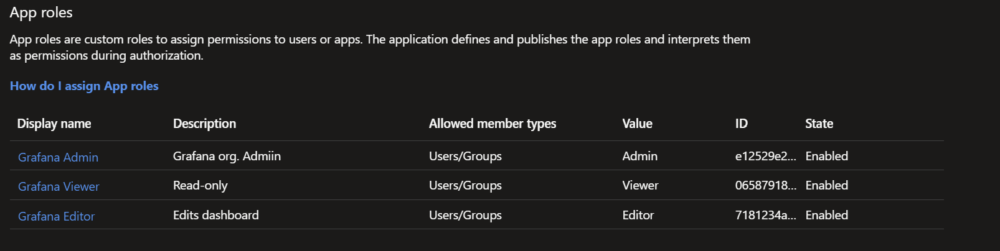

> Requires Entra ID P2. Microsoft recommends requiring approval for eligible member activations on
> groups that elevate access.
> [PIM for Groups](https://learn.microsoft.com/entra/id-governance/privileged-identity-management/concept-pim-for-groups).

**Where this differs from best practice.** Activation uses regular Azure MFA, not a
phishing-resistant method, so the everyday privileged path is protected slightly more weakly than
the break-glass account. Approval, justification and a short window carry it here. See
[decision 4](decisions.md).

Done in the portal deliberately: one-time privileged config where every setting should be visible.

---

## 1. Bring `grafana-admins` under PIM

**Entra admin center > ID Governance > Privileged Identity Management > Groups**, select
`grafana-admins`.

> Once a group is PIM-managed it cannot be taken back out, by design, so another admin cannot
> quietly strip the settings.

## 2. Remove standing admin, assign eligibility

**1.** Remove Amanda from `grafana-admins` and add her to `grafana-editors`.

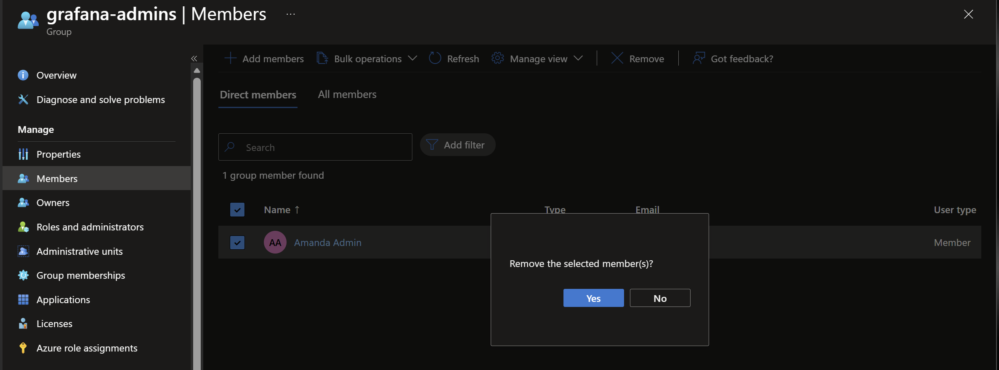
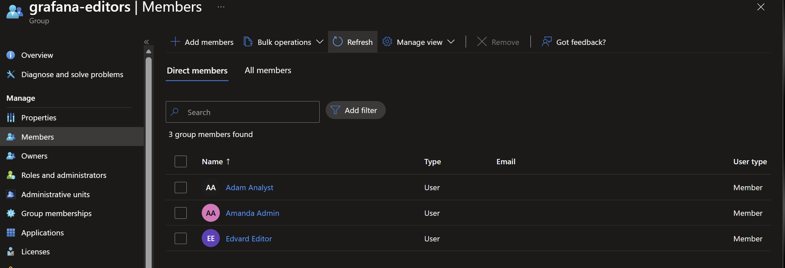

**2.** Make Amanda and Edvard **eligible** members for the next 12 months.

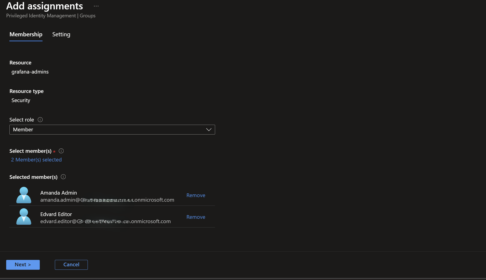

**3.** Both now sit under Eligible assignments with no standing membership.

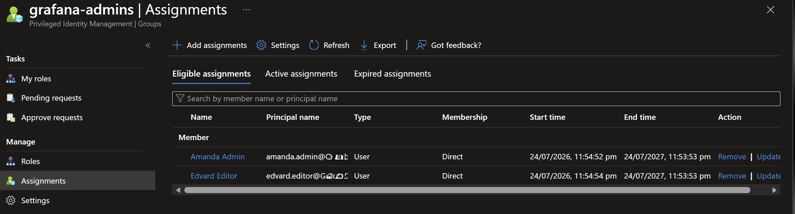

## 3. Activation settings

**Groups > grafana-admins > Settings > Member > Edit**:

- Require multifactor authentication on activation: **On** (Azure MFA)
- Require justification on activation: **On**
- Require approval to activate: **On**, approver **Sindre G**
- Activation maximum duration: **6 hours**
- Notifications: **On**
- Leave "Require pre-approval custom extension (Preview)" unchecked. It calls a custom Logic App we
  have not built and is not the same as "Require approval to activate".

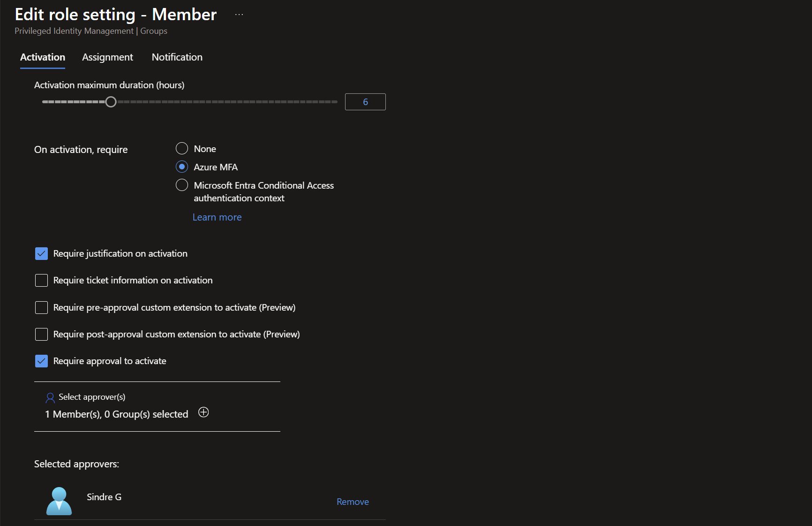

---

## 4. Test: activate, approve, revoke early

**1.** Amanda opens **PIM > My roles > Groups** and sees her eligible assignment.

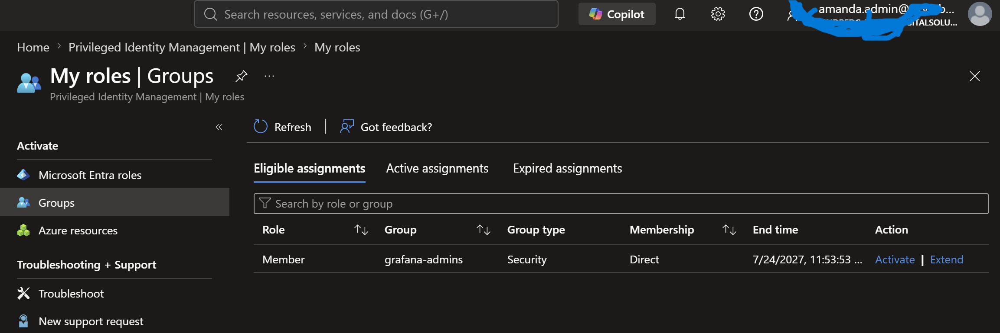

**2.** She activates for **0.5 hours** with the reason "Managing users and teams in Grafana".

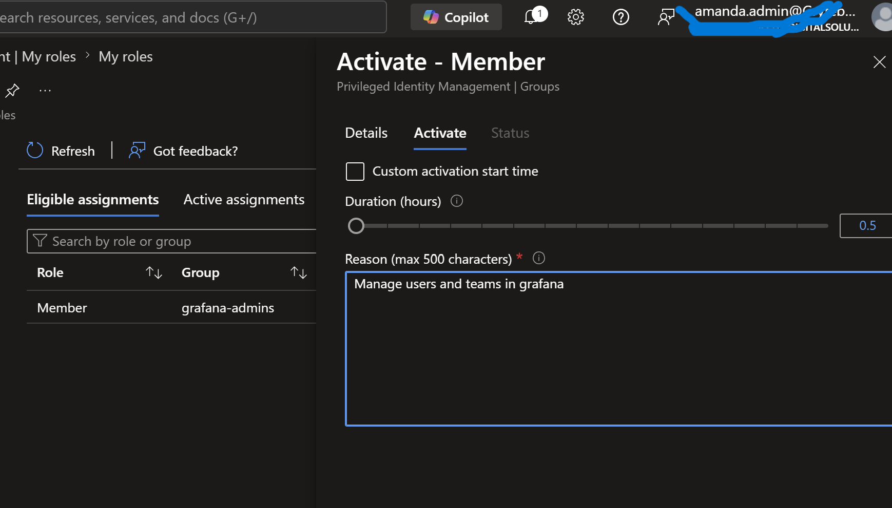

**3.** Sindre G approves, with a reason.

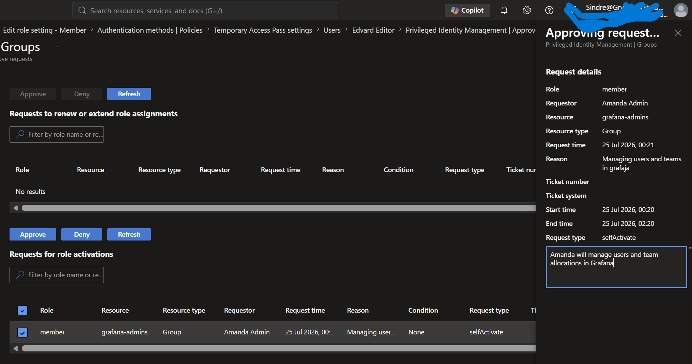

**4.** Active assignments shows **Activated**, and after a fresh Grafana sign-in Amanda has the
Admin role. The app-role claim is issued at sign-in, so the fresh sign-in is required.

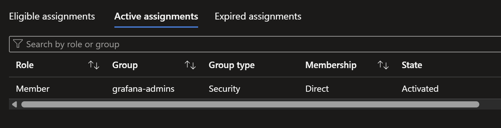

**5.** Amanda finishes early, so Sindre G removes her membership before the window expires.

**6.** The audit log (**grafana-admins > My audit**) carries the whole sequence: activation
requested and completed, then removal requested and completed.

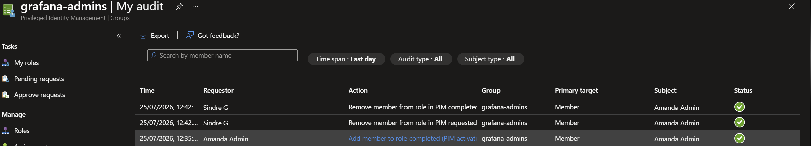

Amanda held Admin for minutes rather than permanently, and who, when, why and who approved are all
in the log.

---

## Verification / test matrix

| # | Test | Type | Expected |
| --- | --- | --- | --- |
| 1 | Amanda before activation | + / control | Standing Editor only, no Admin |
| 2 | Activation requires MFA + justification + approval | + | Cannot activate without all three |
| 3 | After approval + fresh Grafana sign-in | + | Amanda has the Admin role |
| 4 | Early removal (or expiry) | + | Membership and Admin role removed |
| 5 | Audit log | + | Captures activation and early removal, with reasons and approver |
| 6 | Break-glass account | + / control | Keeps standing access, never placed under PIM |

---

## Notes

- **Separation of duties.** Sindre G approves but is not eligible, so nobody approves their own
  elevation.
- `grafana-admins` drives the Admin role through the group-to-app-role mapping and SCIM, so
  activation and deactivation propagate to Grafana.
- Approval works cleanly here because `grafana-admins` governs app access. For groups that elevate
  into Entra directory roles, approval behaviour is governed at the Entra-role level instead.

---

### Reference
- [PIM for Groups](https://learn.microsoft.com/entra/id-governance/privileged-identity-management/concept-pim-for-groups)
- [Bring groups under PIM management](https://learn.microsoft.com/entra/id-governance/privileged-identity-management/groups-discover-groups)
- [Assign eligibility for a group in PIM](https://learn.microsoft.com/entra/id-governance/privileged-identity-management/groups-assign-member-owner)
- [Configure PIM for Groups settings](https://learn.microsoft.com/entra/id-governance/privileged-identity-management/groups-role-settings)
