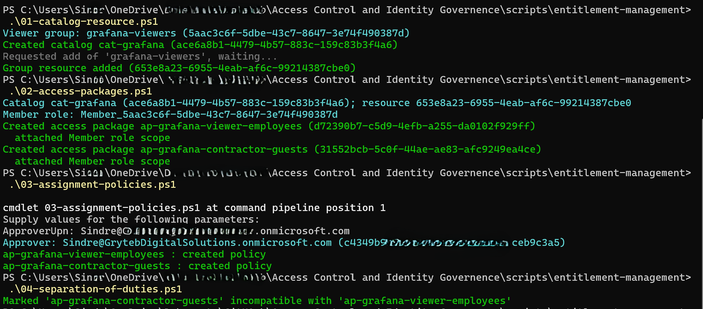
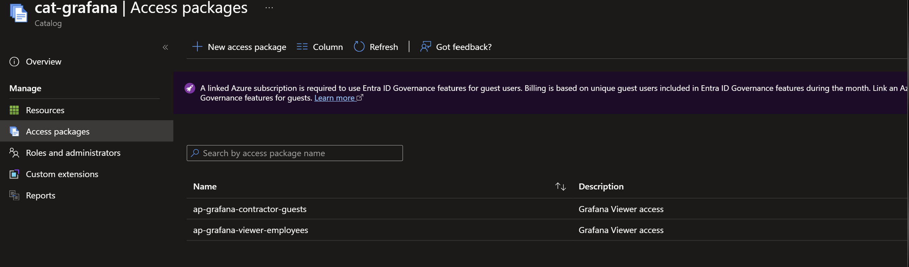
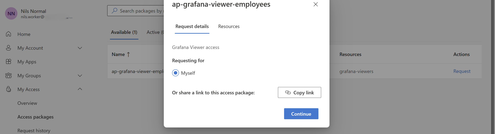
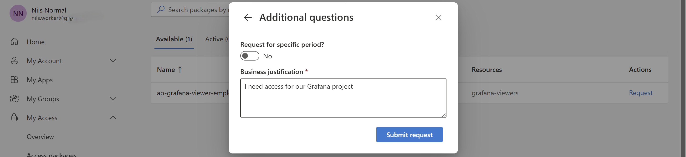
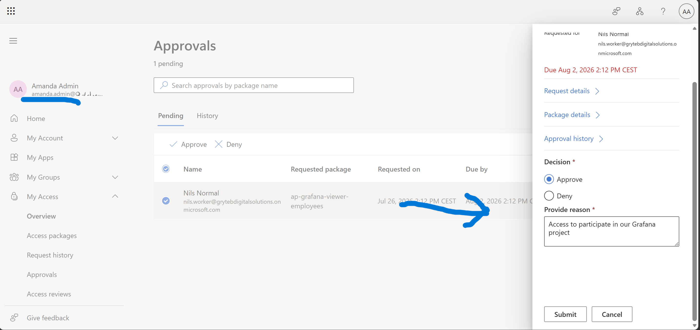
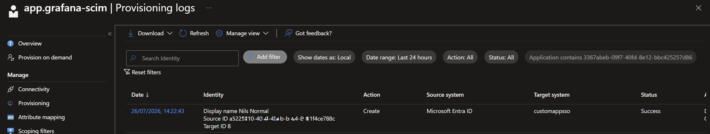
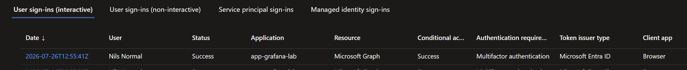

# Entitlement management: self-service access packages (Phase 4)

**Goal:** turn Grafana access from a manual group-add into a **self-service, approved, time-bound
request**. Internal employees request through the **My Access** portal; external contractors get
governed, auto-expiring guest access. This is where the project moves from *access control* to
*access governance*: every grant now has a requestor, an approver, a justification, and an expiry.

> Requires Microsoft Entra ID P2 (or Entra ID Governance). Built **as code** with Microsoft Graph,
> split into small ordered scripts under `scripts/entitlement-management/`, then verified and tested
> in the portal / My Access. See
> [What is entitlement management](https://learn.microsoft.com/entra/id-governance/entitlement-management-overview).

**Why this matters.** Before this phase, giving someone access meant an admin adding them to a group,
with no record of who asked, who approved, or when it should end. Access packages turn that into a
request with an approver, a justification, and an expiry, so access is governed rather than just
granted.

**Trade-off from best practice.** Two things are worth naming. The assignment durations (90 days for
employees, 30 for contractors) are sensible defaults rather than the output of a data
classification; ideally they would follow whatever review cadence Phase 5 sets (see
[ADR 0007](adr/0007-access-package-durations.md)). And the separation-of-duties marking, as built,
cannot actually fire, because the two packages already target mutually exclusive populations; a
meaningful pairing (for example an admin package against an audit or review package) is what this
would look like done properly. We call that out in section 4 below.

## What we build

| Object | What it does |
| --- | --- |
| Catalog `cat-grafana` | Container that holds the Grafana groups as requestable resources |
| `ap-grafana-viewer-employees` | Grants `grafana-viewers` to internal users, manager approval, 90-day expiry |
| `ap-grafana-contractor-guests` | Grants `grafana-viewers` to external / B2B users, approver Sindre G, 30-day expiry |
| Separation of duties | The two packages are marked incompatible |

Granting group membership flows straight through to Grafana: the group is mapped to an app role on
the enterprise app and provisioned by SCIM, so an approved request ends in a real Grafana account,
and an expired one is deprovisioned.

---

## 1. Deploy as code

Entitlement management has a chained, partly asynchronous object graph, so we split the deployment
into four small, ordered, idempotent scripts. Each resolves everything by name (catalog, group,
packages, approver), so a failure in one step doesn't block the others.

```powershell
# scripts/entitlement-management  (reset any earlier attempt first, see the folder README)
.\01-catalog-resource.ps1                    # catalog cat-grafana + grafana-viewers resource
.\02-access-packages.ps1                      # the two packages + Member role scope
.\03-assignment-policies.ps1 -ApproverUpn "Sindre@<tenant>.onmicrosoft.com"
.\04-separation-of-duties.ps1                 # mark the two packages incompatible
```



## 2. Verify in the portal

We open **ID Governance > Entitlement management > Access packages** and confirm both packages, each
with the `grafana-viewers` **Member** resource role, the request policies, and the incompatibility.



---

## 3. Test in the My Access portal (employee self-service)

We ran the internal flow end to end with **Nils Normal**
(`nils.worker@<tenant>.onmicrosoft.com`), who has no standing Grafana access.

**1.** Nils opens `https://myaccess.microsoft.com`, sees **ap-grafana-viewer-employees** as the one
package available to him, and selects **Request**.



**2.** He requests for himself and enters a business justification ("I need access for our Grafana
project").



**3.** His **manager, Amanda Admin**, gets the pending approval in My Access and approves it with a
reason. The request routed to the manager automatically, using the manager relationship seeded in
Phase 0, no approver was named on this policy.



**4.** Entra grants the assignment and the SCIM connector provisions Nils into Grafana (provisioning
log: **Create, Success**).



**5.** Nils signs in to Grafana and lands on the **Viewer** role. This step first failed with
**"User sync failed"** (a Grafana-side identity-reconciliation issue between the SCIM-created account
and the OIDC login); see the [troubleshooting log](99-troubleshooting.md) for the one-line config fix.
After the fix, sign-in succeeds.




---

## 4. Separation of duties (configured)

`04-separation-of-duties.ps1` marks the two packages **incompatible**, visible under each package's
**Separation of Duties** tab in the portal. Holding one package then blocks requesting the other. We
did not exercise this live: by design, no single user can hold both, since one package targets
internal users and the other targets external guests, so there is no persona that could trigger the
block. The guardrail is deployed and verifiable in the portal.

---

## The external contractor path (design, not live-tested)

The second package, **ap-grafana-contractor-guests**, governs external / B2B access. We built and
deployed it, but did not run it end to end because the test contractor lives in a separate tenant we
do not hold credentials for. The design is what matters, and it is the more interesting half of
entitlement management:

- **The request creates the guest.** The contractor policy's requestor scope is *All external users*
  (`AllExternalSubjects` in `03-assignment-policies.ps1`), so the contractor does **not** need to
  exist in our tenant first. We hand them a tenant-scoped My Access link
  (`https://myaccess.microsoft.com/@<tenant>.onmicrosoft.com`); they sign in with their own external
  email and request the package. Approval by **Sindre G** is what triggers the **B2B guest
  invitation** automatically, so the invite, the guest object, and the access grant are one governed
  flow rather than a manual "invite guest, then add to group" chore.
- **Auto-expiry is the point.** The assignment is time-bound to **30 days**. When it lapses, the group
  membership is removed, SCIM deprovisions the Grafana account, and the guest is left with no standing
  access, no manual cleanup. This is how you keep contractor sprawl from accumulating.
- **Separate approver on purpose.** External access routes to a designated approver (Sindre G) rather
  than a manager, because a contractor has no manager relationship in our directory. This mirrors the
  real split between internal (manager-approved) and external (owner-approved) governance.

---

## Verification / test matrix

| # | Test | Type | Result |
| --- | --- | --- | --- |
| 1 | Nils requests the viewer package | + | Provisioned only after approval (verified) |
| 2 | Approval routing | + | Routed automatically to the manager (Amanda), no named approver |
| 3 | Nils after approval + Grafana sign-in | + | Gets the Grafana Viewer role (after the user-sync fix) |
| 4 | Contractor package (external / B2B) | design only | Deployed and explained above; not run live (no credentials for the external tenant) |
| 5 | Separation of duties | configured | Packages marked incompatible; visible in the portal, not live-exercised (see section 4) |
| 6 | Every grant | + | Has a requestor, approver, justification, and expiry in the request history |

Evidence captured into `images/phase4/`: the four deploy scripts, the packages and resource roles in
the portal, Nils's request and justification, Amanda's approval, the SCIM provisioning log, the
initial "User sync failed" error, and Nils's successful Grafana Viewer sign-in.

---

## Notes

- **The whole point is the trail.** Before this phase, access was a manual group-add with no record.
  Now every grant answers who requested it, who approved it, why, and when it expires.
- **Two approval patterns on purpose.** Internal requests route to the requestor's manager (using the
  manager relationships seeded in Phase 0); external contractor requests route to a designated
  approver (Sindre G). This shows both the self-service and the governed-external models.
- **Provisioning reuses the existing pipeline.** Access packages grant group membership, which the
  enterprise app maps to an app role and SCIM provisions to Grafana, so no new integration is needed.
- **Feeds Phase 5.** An access review on each package policy is where recurring attestation (Phase 5)
  picks up.

---

### Reference
- [What is entitlement management](https://learn.microsoft.com/entra/id-governance/entitlement-management-overview)
- [Manage access packages with the entitlement management APIs](https://learn.microsoft.com/graph/tutorial-access-package-api)
- [Separation of duties (incompatible access packages)](https://learn.microsoft.com/entra/id-governance/entitlement-management-access-package-incompatible)
- [My Access portal](https://learn.microsoft.com/entra/id-governance/my-access-portal-overview)
