# Access reviews: recurring attestation and auto-revocation (Phase 5)

**Built:** three recurring access reviews, one per Grafana tier, with apply behaviour matched to
risk. A denial on the viewer review revokes straight through the group and SCIM to the Grafana
account.

| Review | Group | Reviewer(s) | Auto-apply | A denial means |
| --- | --- | --- | --- | --- |
| ar-grafana-viewers | `grafana-viewers` | Amanda | On | Access removed automatically, SCIM revokes |
| ar-grafana-editors | `grafana-editors` | Sindre G | Off | Recorded, then removed manually |
| ar-eligable-grafana-admin | `grafana-admins` (PIM) | Managers, then Sindre G | Off | Recorded, applied manually after a PIM check |

> Requires Entra ID P2 or Entra ID Governance.
> [What are access reviews](https://learn.microsoft.com/entra/id-governance/access-reviews-overview).

Done in the portal, like PIM. The reviewer experience happens in My Access.

---

## 1. The viewer review

**ID Governance > Access reviews > New access review**:

- **Review type**: Teams + Groups, scope `grafana-viewers`, **All users**
- **Reviewers**: Selected user, **Amanda Admin**. Duration 3 days, recurrence Quarterly, start
  today, end Never

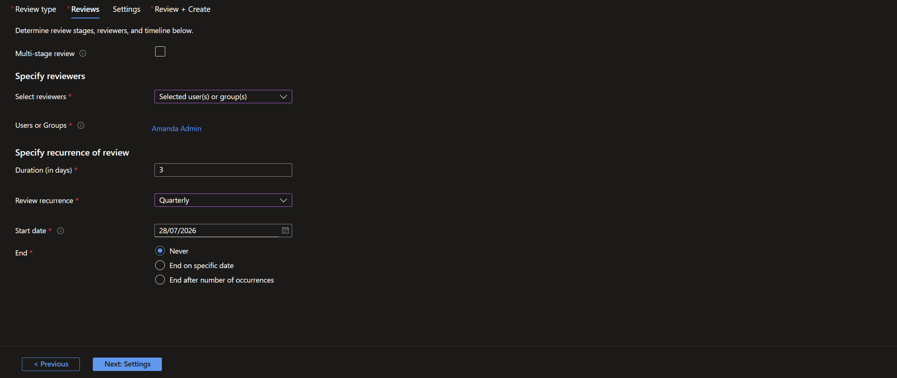

- **Auto apply results to resource**: Yes
- **If reviewers don't respond**: Remove access
- **Decision helper, no sign-in within 30 days**: Yes
- **Justification required**, **Email notifications**, **Reminders**: Yes

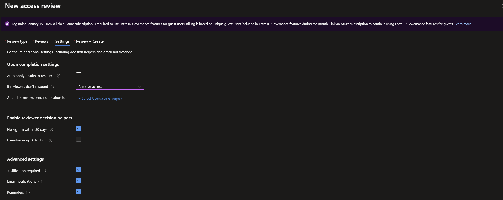

The first instance starts within a few minutes.

## 2. Amanda reviews in My Access

**1.** She opens `https://myaccess.microsoft.com > Access reviews` and sees `ar-grafana-viewers`
with every current member and a recommendation per name. Active users show Approve; the inactive
test user `nils.new` is flagged **Deny, Inactive user** by the no-sign-in helper.

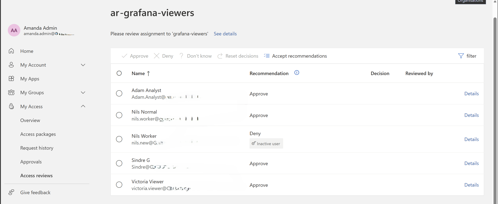

**2.** She approves the four active users (Adam, Nils Normal, Sindre G, Victoria) in one action
with a reason.

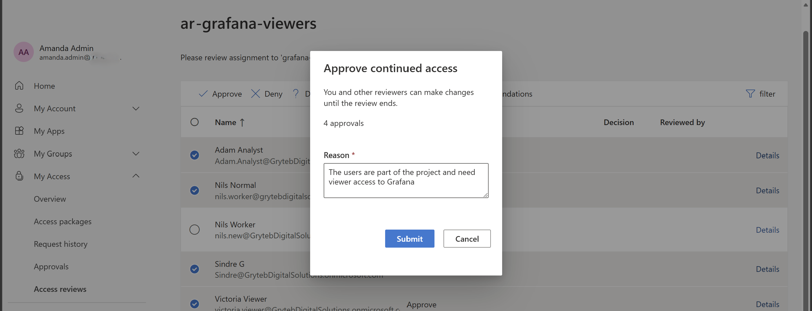

**3.** She denies the inactive user, following the recommendation.

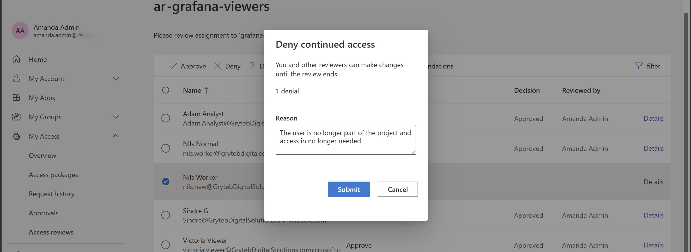

> Two Nils personas on purpose. **Nils Normal** (`nils.worker`) is the active requestor from Phase 4
> and is approved. **Nils Worker** (`nils.new`) is deliberately inactive, so the decision helper has
> something to flag.

**4.** Results record every decision, the recommendation and the reviewer. Auto-apply removes the
denied user from `grafana-viewers` when the review ends, SCIM deprovisions, and the Grafana Viewer
role goes: the exact reverse of the Phase 4 grant.

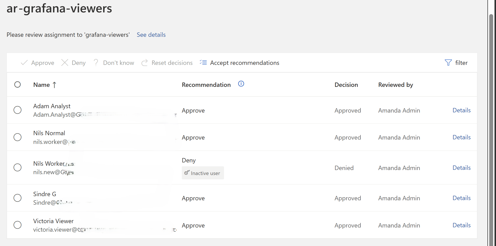

---

## 3. The editor review: attest and audit, no auto-revoke

Same shape over `grafana-editors`, reviewed by Sindre G, with two deliberate differences:
**Auto apply is off**, and **If reviewers don't respond is No change**, so a missed cycle does not
lock the editors out. Cadence, decision helpers and justification match the viewer review.

Decisions are recorded and audited, but nothing is removed automatically. A denial becomes a
documented signal to remove that editor deliberately, which suits a role that can change dashboards
and data sources.

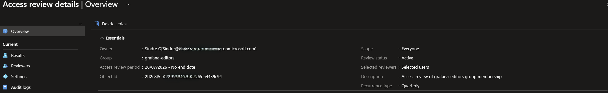

## 4. The admin eligibility review: two-stage, manual apply

`grafana-admins` is PIM-managed, so this review carries two safeguards.

**1. Two-stage review.** New access review over `grafana-admins`. The portal confirms the group is
PIM-managed and that the review covers **both eligible and active** assignments, since there is no
eligible-only scope for a group. Stage one is the users' managers, stage two is Sindre G as
independent final reviewer, who can overwrite the managers' decisions. Recurrence monthly.

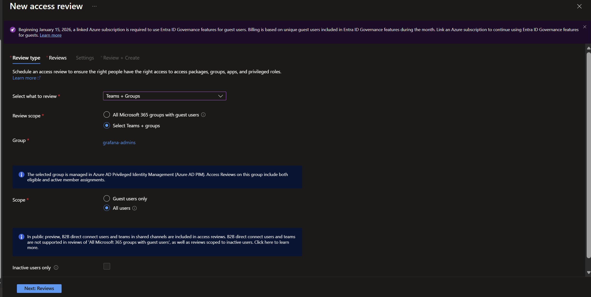
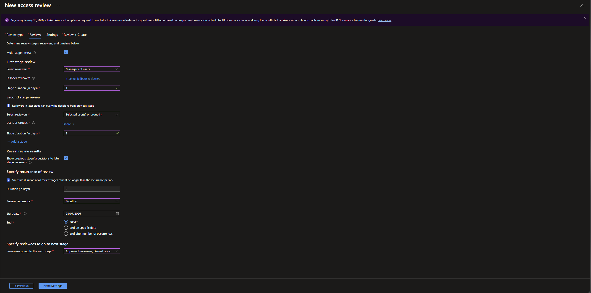

**2. Auto-apply off.** On a PIM-managed group, auto-applying a decision can convert an **eligible**
member into a **standing** admin, which is what happened the first time we tried this. So auto-apply
stays unchecked, and results are applied manually only after confirming in
**PIM > Groups > grafana-admins > Assignments** that approved users are still Eligible, not Active.

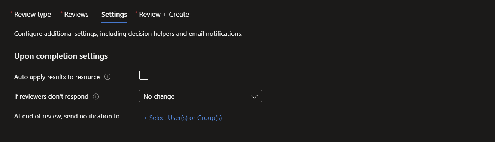

All three reviews in place:

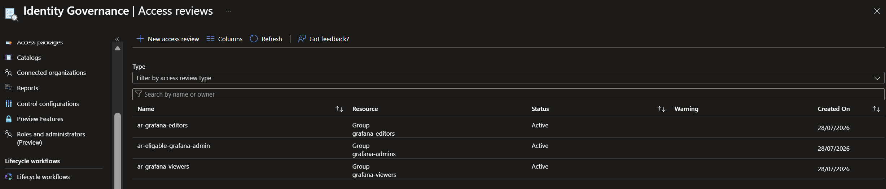

---

## Verification / test matrix

| # | Test | Type | Result |
| --- | --- | --- | --- |
| 1 | Review runs over `grafana-viewers` | + | Lists every current member, reviewer Amanda |
| 2 | Active users approved | + | Access retained, recorded with a reason |
| 3 | Inactive user denied | + | Removed from group, SCIM deprovisions, Grafana Viewer role gone |
| 4 | Decision helper | + | Flags the inactive user (no sign-in within 30 days) as Deny |
| 5 | Reviewer does not respond | control | No change, per the chosen setting |
| 6 | Results / audit | + | Full record of reviewer, decision and reason |
| 7 | Editor review (Sindre, auto-apply off) | + | Decisions recorded and audited, denial actioned manually |
| 8 | Admin eligibility review (PIM, two-stage) | + | Managers then Sindre, auto-apply off, decisions recorded |
| 9 | PIM safety check after manual apply | control | Approved admins remain Eligible, never promoted to standing |

---

## Notes

- **Review the group, not just the package.** `grafana-viewers` catches everyone with Viewer access
  however they got it, including anyone added outside entitlement management.
- **Removal reuses the grant pipeline.** A denied member leaves the group, SCIM deprovisions. No
  separate teardown.
- **Decision helpers recommend, they do not decide.** The no-sign-in signal speeds the reviewer up;
  Amanda still chooses.
- **No response means no change** on the editor review, so a busy reviewer missing a cycle does not
  lock people out. Entra can remove access instead, which is stricter.
- Phase 3 grants privilege just-in-time, Phase 4 grants access self-service, Phase 5 makes someone
  re-justify all of it on a schedule.

---

### Reference
- [What are access reviews](https://learn.microsoft.com/entra/id-governance/access-reviews-overview)
- [Create an access review of groups and applications](https://learn.microsoft.com/entra/id-governance/create-access-review)
- [Complete an access review in My Access](https://learn.microsoft.com/entra/id-governance/perform-access-review)
- [Review recommendations (decision helpers)](https://learn.microsoft.com/entra/id-governance/review-recommendations-access-reviews)
