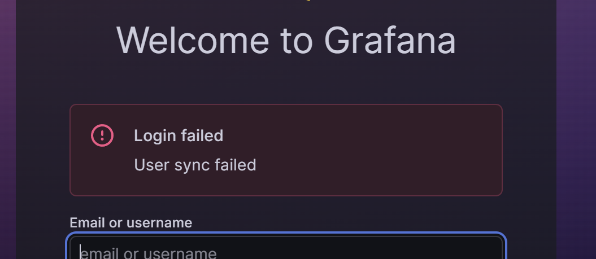
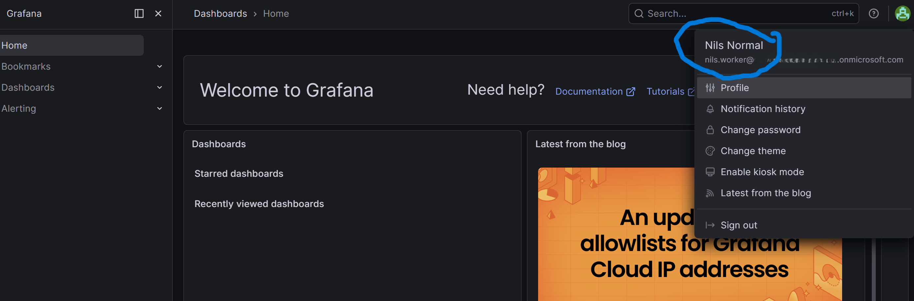

# Troubleshooting log (unexpected things that occurred)

A running log of things that did not go as expected, in the format: symptom, cause, fix, lesson.
The happy path lives in the phase walkthroughs; this file is where the real learning is captured.

---

## Phase 0: FIDO2 passkey registered, but sign-in only prompted for normal MFA

**Symptom.** After registering a FIDO2 passkey on the break-glass account, the first sign-in
used the key as expected. But after signing out and back in, the account was only prompted for
normal MFA (Microsoft Authenticator), not the FIDO2 key.

**Cause.** Registering a passkey makes the method *available*, it does not make Entra *require*
it. The account still had other authentication methods registered (Authenticator / phone). Those
were pulled in partly by the SSPR (self-service password reset) "proof-up" prompt, which asks the
user to register phone / Authenticator. With multiple methods present, Entra offered the default
one at sign-in instead of the key.

**Fix.**
1. Removed all non-FIDO2 methods (Authenticator, phone/SMS, email) from the account, leaving the
   FIDO2 key as the only method.
2. Stopped SSPR from re-adding a proof-up: scope SSPR away from the account, or disable admin
   SSPR via `Update-MgPolicyAuthorizationPolicy`.
3. Re-tested: sign-in now goes straight to the FIDO2 key.

**Lesson.** Registration is not enforcement. For a break-glass account, making FIDO2 the *only*
method forces phishing-resistant sign-in with no Conditional Access policy involved. For normal
users you get the same guarantee the other way: enforce it with a Conditional Access
phishing-resistant authentication strength (Phase 2), not by stripping methods.

**How to prove it.**
- Registered (portal): Users, the account, Authentication methods, "Passkey (FIDO2)" listed.
- Registered (Graph):
  ```powershell
  Connect-MgGraph -Scopes "UserAuthenticationMethod.Read.All"
  Get-MgUserAuthenticationFido2Method -UserId "<breakglass-upn>" |
      Select-Object DisplayName, Model, CreatedDateTime
  ```

---

## Phase 1: Environment - PowerShell won't run the script ("not digitally signed")

**Symptom.** Running a repo script (for example `.\Deploy-CaPolicy.ps1 -List`) fails with
`File ... cannot be loaded. The file ... is not digitally signed. You cannot run this script on
the current system.`

**Cause.** Two things together: the machine's PowerShell execution policy (RemoteSigned or
AllSigned) blocks unsigned scripts that carry the "mark of the web", and files synced through
OneDrive or downloaded from GitHub get that mark, so freshly synced repo scripts are treated as
untrusted remote files.

**Fix.** Either allow scripts for the current session only (reverts when the window closes):
```powershell
Set-ExecutionPolicy -Scope Process -ExecutionPolicy Bypass
```
Or, as a standing dev-machine setup, allow local and signed-remote scripts for your user and
strip the mark of the web from the repo:
```powershell
Set-ExecutionPolicy -Scope CurrentUser -ExecutionPolicy RemoteSigned
Get-ChildItem -Path . -Recurse -Filter *.ps1 | Unblock-File
```

**Lesson.** This is an environment issue, not a code issue. Scripts pulled from OneDrive or GitHub
carry a mark-of-the-web zone tag; with RemoteSigned or AllSigned they need `Unblock-File` or a
relaxed execution policy. Prefer `-Scope Process Bypass` while iterating so the machine default
stays strict.

---

## Phase 1 · Password reset locks a user out of MFA registration (CA008 deadlock)

**Symptom.** After resetting a test user's password (Adam), sign-in and
`https://aka.ms/mysecurityinfo` both returned: "Your sign-in was blocked. We are currently
unable to collect additional security information. Your organisation requires this information
to be set from specific locations or devices."

**Cause.** `CA008-SecurityInfoRegistration-MFA` requires MFA to register security info. The
password reset left the account with no usable MFA method, so the user is deadlocked: they can't
do MFA (nothing registered) and can't register (policy requires MFA first).

**Fix.** Bootstrap the user with a Temporary Access Pass (a TAP counts as MFA), then let them
register their real method. Getting there surfaced three sub-issues, each a lesson on its own:
1. The TAP *method* was off by default. Enable it first:
   `PATCH /policies/authenticationMethodsPolicy/authenticationMethodConfigurations/TemporaryAccessPass`
   with `state = enabled` and an `includeTargets` group (`all_users`).
2. `New-MgUserAuthenticationTemporaryAccessPassMethod` returned 404 "user could not be found"
   because the UPN still had the literal `<tenant>` placeholder. Resolve the user first
   (`Get-MgUser`) and pass the object Id.
3. The pass code is only returned at creation and is not in the default table output. Capture it
   explicitly: `$result.TemporaryAccessPass`. A TAP already existing blocks creating another, so
   delete the old one first.

The user then signs in with the TAP code instead of a password, which satisfies MFA, passes
CA008, and lets them register. TAP is time-limited (60 min here), so register promptly, ours
expired mid-test and had to be reissued.

Quick alternative unblock: set CA008 to `enabledForReportingButNotEnforced`, let the user register
password + Authenticator, then set it back to `enabled`.

**Lesson.** Any policy that gates MFA *registration* creates a chicken-and-egg for users who have
no MFA yet (new hires, password resets that clear methods). Pair it with TAP-based onboarding or a
trusted-location exception so first registration is possible. This is the same TAP pattern the
Phase 6 lifecycle workflows use for new-hire onboarding.---

---

## Phase 4 · Grafana "Login failed: User sync failed" after access-package + SCIM provisioning

**Symptom.** Nils's access to `grafana-viewers` was requested via the access package and approved by
his manager (Amanda). The Entra **provisioning logs** show the SCIM sync succeeded, and the Entra
**sign-in logs** show a successful sign-in. But when Nils signs in to the Grafana app itself, Grafana
returns **"Login failed: User sync failed."**



**Cause.** Two provisioning paths manage the same person: SCIM **pre-created** the Grafana user, and
now OIDC login tries to reconcile against that existing account. Since the CVE-2023-3128 hardening,
Grafana **does not link an OAuth/OIDC login to an existing user by email by default**
(`oauth_allow_insecure_email_lookup` defaults to `false`). So the OIDC login can't match the
SCIM-created account, and the user sync fails. Entra is doing its job (it issued a valid token and
SCIM synced the account); the failure is entirely on the Grafana side reconciling two identities for
one user.

**Fix.**
1. Confirm the exact reason in the **Grafana server logs** (`sudo docker compose logs -f grafana` on
   the VM) - look for a user lookup / duplicate email line around the failed login.
2. Allow OAuth to link to the existing SCIM user by email. Because our compose file uses the
   `KEY: "value"` mapping style, we added to the grafana service `environment:` block:
   ```yaml
   GF_AUTH_OAUTH_ALLOW_INSECURE_EMAIL_LOOKUP: "true"
   ```
   (Equivalently, `grafana.ini` under `[auth]`: `oauth_allow_insecure_email_lookup = true`.)
3. Recreate the container so the new env var is actually applied (a plain restart is not enough, env
   changes only take effect on recreate):
   ```bash
   sudo docker compose up -d --force-recreate grafana
   sudo docker compose exec grafana env | grep INSECURE_EMAIL_LOOKUP   # confirm it is set
   ```
   Look for **"Container grafana Recreated"** (not "Running") and the grep echoing the value. Nils
   then signs in and lands on the Viewer role.

   
4. Alternative (no email matching at all): align on the stable immutable ID so login and
   pre-provisioning reconcile on `oid`/`sub` rather than email. That means making the SCIM bridge set
   the Grafana user's auth identity to the same Entra object ID the OIDC token presents. More work and
   a bridge change, but it removes the need for the flag entirely.

**Note:**
The setting name is deliberately alarming, so it is worth being precise about the risk and why it is
acceptable *here*.
- **The risk it guards against (CVE-2023-3128).** Email-based linking is dangerous when the IdP hands
  out email claims that are **unverified and user-settable**. An attacker could set their profile
  email to `victim@company.com`, sign in, get linked to the victim's existing Grafana account, and
  take it over. That is exactly why Grafana disabled email lookup by default.
- **Why it is acceptable in this lab.** The precondition (untrusted, self-settable email) does not
  hold. The IdP is **our own single Entra tenant**; the email / UPN comes from accounts we provision,
  users cannot freely rewrite their verified UPN to impersonate someone else, and every sign-in has
  already passed Conditional Access and MFA. We already trust Entra's email claim for everything else
  in the project, so trusting it for account linking adds no new trust assumption.
- **When it would be bad.** Multi-tenant or federated setups where email claims come from IdPs you do
  not control, or any tenant that allows unverified self-service email edits. There, prefer the
  immutable-ID approach in fix step 4 and leave the flag `false`.

**Verdict:** ok for a lab single-tenant environment, self-controlled IdP with verified emails; genuinely risky
in multi-tenant / federated contexts.

**Lesson.** When both SCIM pre-provisioning and JIT OIDC login manage the same user, **identity
reconciliation is the hard part, not provisioning.** "Entra sign-in succeeded" and "SCIM synced" do
not guarantee the app accepts the login; the application still has to match the two identities to one
account. Grafana's secure-by-default email lookup is a very common gotcha in combined SCIM + OIDC
setups, and the "right" long-term fix is to reconcile on immutable IDs, not email.

---

## Entry template (copy for the next one)

## Phase X · <short symptom title>

**Symptom.** What you saw.

**Cause.** Why it happened.

**Fix.** What resolved it (numbered if multiple steps).

**Lesson.** The takeaway worth remembering.

